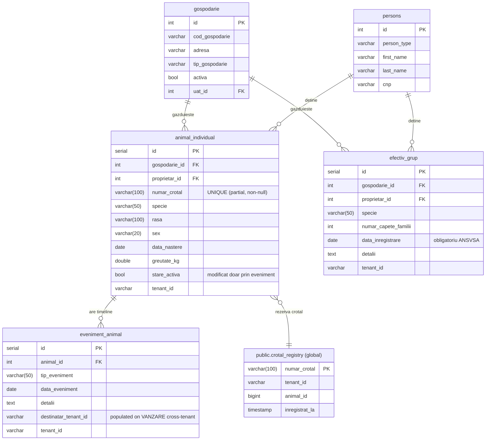
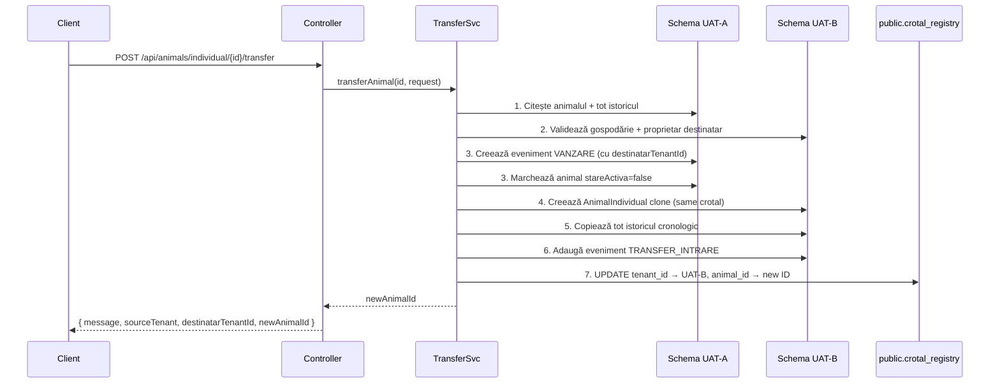

# Gestiune Animale — Documentație Tehnică
**Registru Agricol Multi-Tenant | SNIIA/ANSVSA Compliance**

---

## 1. Prezentare Generală

Modulul de Gestiune Animale implementează cerințele legislative românești privind evidența animalelor agricole, conform:
- **Legea nr. 195/2018** — Registrul Agricol (obligația UAT-urilor de a ține evidența animalelor)
- **Ordinul ANSVSA nr. 40/2010** — Sistemul Național de Identificare și Înregistrare a Animalelor (SNIIA)
- **Regulamentul UE 2016/429** — Sănătatea animală

---

## 2. Mapare Business Logic → Cod

| Cerință Legală | Entitate/Mecanism |
|---|---|
| Identificare unică prin crotal (ear-tag) | `AnimalIndividual.numarCrotal` + `public.crotal_registry` |
| Trasabilitate completă (mișcări/evenimente) | `EvenimentAnimal` (append-only timeline) |
| Evidența efectivelor de grup cu datare | `EfectivGrup` (model snapshot, `dataInregistrare` obligatoriu) |
| Tratamente veterinare înregistrate | `TipEvenimentAnimal.TRATAMENT_VETERINAR` |
| Transfer inter-exploatație cu istoric | `CrossTenantTransferService` (7 pași atomici) |
| Crotal unic la nivel național (SNIIA) | `public.crotal_registry` + `CrotalRegistryService` |
| Legătură animal → gospodărie | `AnimalIndividual.gospodarie` (`@ManyToOne`, `NOT NULL`) |

### Ciclul de viață al unui animal individual

```
NASTERE / CUMPARARE / TRANSFER_INTRARE   ← un singur eveniment de origine
        ↓
TRATAMENT_VETERINAR (repetabil, 0..N)
        ↓
VANZARE / SACRIFICARE_PROPRIE / MOARTE / UCIDERE_FOCAR / DISPARITIE  ← terminal
        ↓
  stareActiva = false (frozen timeline)
```

---

## 3. Schema Bazei de Date



### Migrații Flyway

| Fișier | Schema | Conținut |
|---|---|---|
| `db/migration/V10__global_crotal_registry.sql` | `public` | Tabela `crotal_registry` (global) |
| `db/tenant/V11__create_animal_tables.sql` | per-tenant | Tabele `animal_individual`, `efectiv_grup` |
| `db/tenant/V12__create_eveniment_animal_table.sql` | per-tenant | Tabela `eveniment_animal` + index |
| `db/tenant/V13__animal_module_improvements.sql` | per-tenant | Unique crotal, `destinatar_tenant_id`, `data_inregistrare`, indexuri |

---

## 4. Endpoints API

### Animale Individuale

| Metodă | URL | Descriere |
|---|---|---|
| `GET` | `/api/animals/individual` | Lista tuturor animalelor din tenant |
| `GET` | `/api/animals/individual/{id}` | Detalii animal |
| `POST` | `/api/animals/individual` | Înregistrare animal nou |
| `PUT` | `/api/animals/individual/{id}` | Editare date (nu modifică stareActiva) |
| `DELETE` | `/api/animals/individual/{id}` | Ștergere + eliberare crotal global |
| `GET` | `/api/animals/individual/{id}/evenimente` | Timeline complet |
| `POST` | `/api/animals/individual/{id}/evenimente` | Adaugă eveniment la timeline |
| `POST` | `/api/animals/individual/{id}/transfer` | Transfer cross-tenant |

### Efective de Grup

| Metodă | URL | Descriere |
|---|---|---|
| `GET` | `/api/animals/grup` | Lista tuturor snapshot-urilor |
| `GET` | `/api/animals/grup/{id}` | Detalii snapshot |
| `POST` | `/api/animals/grup` | Înregistrare efectiv nou (primul snapshot) |
| `POST` | `/api/animals/grup/{id}/snapshot` | Adaugă snapshot nou (actualizare efectiv) |
| `GET` | `/api/animals/grup/{gospodarieId}/history` | Istoricul complet al efectivelor din gospodărie |
| `DELETE` | `/api/animals/grup/{id}` | Ștergere snapshot individual |

### Interogări Combinate

| Metodă | URL | Descriere |
|---|---|---|
| `GET` | `/api/animals/proprietar/{id}` | Animale individuale + grupuri per proprietar |
| `GET` | `/api/animals/gospodarie/{id}` | Animale + efectiv curent + istoric per gospodărie |

### Autorizare

Toate endpoint-urile sunt accesibile pentru `ROLE_USER`, `ROLE_ADMIN` și `ROLE_SUPER_ADMIN`.

---

## 5. Logica Transferului Cross-Tenant

### Problema

Fiecare UAT (Unitate Administrativ-Teritorială) are propria schemă PostgreSQL izolată (`uat_{SIRUTA}`). Un animal care este vândut din UAT-A în UAT-B trebuie să-și urmeze istoricul complet în schema destinatară — nu poate exista o referință de FK cross-schema.

### Soluția (Option A — Schema Switching)

`CrossTenantTransferService.transferAnimal()` execută 7 pași în ordine:



### Detalii de Implementare & Garanții Tranzacționale

Deoarece dynamic schema routing (conectarea la baze de date diferite prin `search_path`) depinde de conexiunea JDBC obținută la pornirea tranzacției, nu putem schimba schemele în interiorul aceleiași tranzacții. În plus, ordinea implicită de flush a Hibernate (inserările înainte de actualizări) ar genera violări de cheie unică dacă transferul are loc în cadrul aceleiași scheme.

Din acest motiv, `CrossTenantTransferService` folosește programmatic transactions via `PlatformTransactionManager` și `TransactionTemplate` divizând execuția în 3 tranzacții distincte:

1. **Tranzacția de Validare (Destination UAT Context)**:
   - Setează `TenantContext` pe destinație, deschide o tranzacție scurtă și verifică existența gospodăriei și proprietarului destinatar.
   - Dacă aceștia nu există, eșuează instant **înainte** ca sursa să sufere vreo modificare.
2. **Tranzacția de Dezactivare (Source UAT Context)**:
   - Setează `TenantContext` pe sursă, marchează animalul ca `stareActiva = false` și salvează evenimentul `VANZARE`.
   - Această tranzacție se încheie și se comite imediat.
3. **Tranzacția de Creare (Destination UAT Context)**:
   - Setează `TenantContext` pe destinație, înregistrează animalul clonat, copiază timeline-ul istoric și salvează evenimentul `TRANSFER_INTRARE`.
   - Se comite imediat după terminarea operațiilor.

**Mecanism de compensare (Garanție de consistență):**
Dacă pasul 3 (crearea animalului în destinație) eșuează din orice motiv după ce pasul 2 a fost deja comis:
- Blocul `catch` rulează o **tranzacție de compensare** în schema sursă.
- Aceasta reactivează animalul (`stareActiva = true`) și șterge evenimentul `VANZARE` adăugat la pasul 2, readucând baza de date în starea inițială consistentă.

**Identitatea SNIIA se păstrează:**
Crotalul nu se modifică la transfer — registrul național global (`public.crotal_registry`) își actualizează direct pointerii de `tenant_id` și `animal_id` în mod independent.

---

## 6. Unicitatea Globală a Crotalelor

### Arhitectură

```
┌─────────────────────────────────────────────────────┐
│ public.crotal_registry (vizibil tuturor tenant-ilor)│
│ numar_crotal  │ tenant_id │ animal_id               │
│ RO123456789   │ 123456    │ 42                      │
│ RO987654321   │ 789012    │ 17                      │
└─────────────────────────────────────────────────────┘
         ↑                          ↑
  Verificat la create/update   Actualizat la transfer
```

### Flux de validare (CrotalRegistryService)

1. La `create(animal)`:
   - Verifică în `public.crotal_registry` că crotalul nu există la alt tenant
   - Verifică UNIQUE index local (intra-schema, apărare în adâncime)
   - Salvează animalul → `INSERT INTO public.crotal_registry`

2. La `update(id, animal)` cu crotal schimbat:
   - Verifică global (excludând animalul curent prin `(tenantId, animalId)`)
   - Verifică local (excludând rândul prin `id`)
   - `DELETE` crotal vechi + `INSERT` crotal nou în registry

3. La `delete(id)`:
   - `DELETE FROM public.crotal_registry WHERE numar_crotal = ?`

### De ce JdbcTemplate și nu JPA?

`CrotalRegistryService` folosește `JdbcTemplate` (nu `EntityManager`) deoarece Hibernate multi-tenant routing setează automat schema la `uat_{tenantId}` pentru orice query JPA. Tabelul `crotal_registry` este în schema `public`, deci trebuie accesat via conexiunea JDBC brută.

---

## 7. Modelul Snapshot pentru EfectivGrup

Spre deosebire de `AnimalIndividual` (care are un singur rând cu stare curentă + eveniment separat), `EfectivGrup` implementează un model **complet append-only**:

| Operație | Comportament |
|---|---|
| `POST /api/animals/grup` | Insert rând nou (primul snapshot) |
| `POST /api/animals/grup/{id}/snapshot` | Insert rând nou (rândul vechi rămâne în istoric) |
| `GET /api/animals/grup/{gdId}/history` | Returnează toate snapshot-urile, newest first |
| `GET /api/animals/gospodarie/{gdId}` → `grupuriCurente` | MAX(dataInregistrare) per specie |

Aceasta asigură conformitatea cu cerința ANSVSA de datare a fiecărei modificări de efectiv, fără a pierde istoricul anterior.

---

## 8. Tipuri de Evenimente (TipEvenimentAnimal)

| Enum | Categorie | Efect asupra stării |
|---|---|---|
| `NASTERE` | Origine | — |
| `CUMPARARE` | Origine | — |
| `TRANSFER_INTRARE` | Origine | — |
| `TRATAMENT_VETERINAR` | Intermediar | Niciun efect (repetabil) |
| `VANZARE` | Terminal | `stareActiva = false` |
| `SACRIFICARE_PROPRIE` | Terminal | `stareActiva = false` |
| `MOARTE` | Terminal | `stareActiva = false` |
| `UCIDERE_FOCAR` | Terminal | `stareActiva = false` |
| `DISPARITIE` | Terminal | `stareActiva = false` |

**Reguli de validare** (implementate în `EvenimentAnimalService`):
- Un animal poate avea **un singur** eveniment de origine
- Un animal inactiv nu primește niciun nou eveniment
- Data evenimentului nou ≥ data ultimului eveniment existent (ordine cronologică)

---

## 9. Interfața și Evidența Contextuală UAT (UI/UX)

Pentru a asigura o izolare curată a utilizatorilor la nivel de interfață grafică și a preveni trimiterile eronate, aplicația integrează contextul UAT direct în componentele Angular:

### 1. Filtrarea Animalelor după UAT Activ
Când un administrator de tenant (ex. `cluj_admin`) vizualizează tabelul general de animale, interfața **nu** afișează toate animalele din schema respectivă (deoarece sub aceeași schemă pot coexista multiple UAT-uri precum Cluj-Napoca și Florești).
- Componenta `AnimalListComponent` injectează serviciul `UatContextService` și se abonează reactiv la `activeUat$`.
- Atunci când UAT-ul activ se schimbă (din selectorul sidebar), lista se refiltrează automat:
  - Pentru animale individuale: `gospodarie.uat.codSiruta === activeUat.codSiruta`
  - Pentru grupuri: `gospodarie.uat.codSiruta === activeUat.codSiruta`
- Astfel, datele sunt complet izolate vizual, permițând administratorului să vadă exclusiv animalele din UAT-ul pe care îl gestionează la momentul respectiv.

### 2. Cascadarea Gospodăriilor în Modalul de Transfer
Pentru a preveni înregistrarea unui animal într-o gospodărie greșită în timpul transferului:
- Selectarea UAT-ului destinatar în modal se face pe baza codului unic **SIRUTA** (`codSiruta`). Biding-ul pe `codSiruta` rezolvă ambiguitatea valorilor identice de schema-tenant (ex: Cluj-Napoca și Florești au ambele `tenantId = cluj`).
- Schimbarea UAT-ului destinatar apelează serviciul cu parametrii corespunzători: `animalService.getGospodariiByTenant(tenantId, uatCode)`.
- Endpoint-ul `/api/gospodarii` filtrează rezultatele în baza de date folosind codul SIRUTA trimis în query param. Ca rezultat, dropdown-ul de Gospodării Destinatare va conține **exclusiv** gospodăriile localizate în acel UAT specificat, eliminând complet riscul trimiterilor cross-UAT greșite.

### 3. Impersonarea din Superadmin
Pentru utilizatorul `superadmin`, contextul de UAT se adaptează dinamic:
- `UatContextService` subscrie la fluxul de impersonare (`authService.impersonatedTenant`).
- În momentul în care superadmin-ul începe impersonarea unui tenant, serviciul încarcă automat lista de UAT-uri corespunzătoare tenant-ului respectiv, permițând selectarea și operarea contextuală a acestora.
- La terminarea modului de impersonare, starea este resetată complet pentru a menține securitatea și izolarea datelor.
