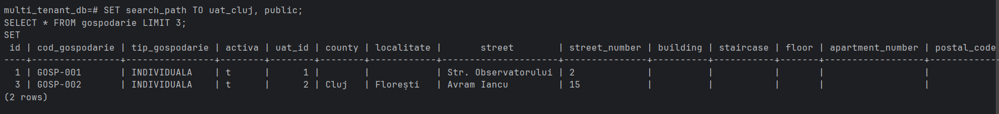
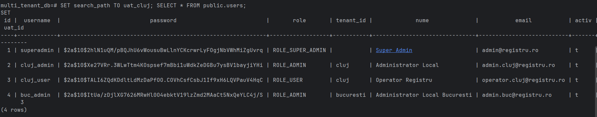
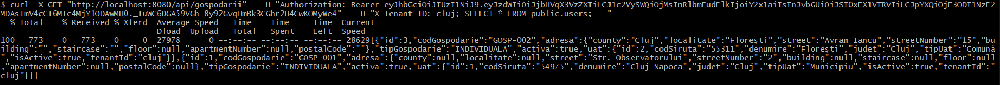

# SQL Injection — Demonstration and Fix
### RegistrulAgricol · MultiTenantConnectionProviderImpl

---

## Vulnerability Description

In the multi-tenant application, each tenant has a separate schema in PostgreSQL (e.g. `uat_cluj`, `uat_bucuresti`). On every request, Hibernate calls `getConnection()` to set the active schema using:

```sql
SET search_path TO uat_<tenantId>, public
```

The problem was that `tenantId` was concatenated **directly** into the SQL string with no validation whatsoever:

```java
// VULNERABLE CODE
schemaName = "uat_" + tenantIdentifier;
connection.createStatement().execute("SET search_path TO " + schemaName + ", public");
```

An attacker could inject arbitrary SQL in place of a valid tenant ID.

---

## Attack Demonstration

### Step 1 — Normal behavior

Legitimate query against the database:

```sql
SET search_path TO uat_cluj, public;
SELECT * FROM gospodarie LIMIT 3;
```

**Expected result:** household records from Cluj.



---

### Step 2 — With malicious payload

Same prefix, but with `;` instead of `, public` and an injected query appended:

```sql
SET search_path TO uat_cluj; SELECT * FROM public.users; --, public
```

This executes **two separate statements**:
1. `SET search_path TO uat_cluj` — sets the schema (normal)
2. `SELECT * FROM public.users` — dumps all users in the system
3. `--, public` — comment, the rest is ignored

**Result:** all users in the system, including password hashes, roles, and emails.



Data exposed:
- username (`superadmin`, `cluj_admin`, `buc_admin`, etc.)
- BCrypt password hash (`$2a$10$...`)
- role (`ROLE_SUPER_ADMIN`, `ROLE_ADMIN`, `ROLE_USER`)
- tenant ID and email

---

## Fix

The fix consists of two measures applied in `MultiTenantConnectionProviderImpl.java`:

### 1. Regex validation

Before concatenation, the tenant ID is strictly validated — only alphanumeric characters, `_` and `-` are allowed, up to 32 characters:

```java
private static final String TENANT_ID_PATTERN = "^[a-zA-Z0-9_-]{1,32}$";

private String resolveSchemaName(String tenantIdentifier) throws SQLException {
    if (tenantIdentifier == null || "public".equals(tenantIdentifier)) {
        return "public";
    }
    if (!tenantIdentifier.matches(TENANT_ID_PATTERN)) {
        throw new SQLException("Invalid tenant identifier: " + tenantIdentifier);
    }
    return "uat_" + tenantIdentifier;
}
```

The payload `cluj; SELECT * FROM public.users; --` contains `;` and spaces — it fails validation immediately, before reaching PostgreSQL.

### 2. Double-quoting the schema name

Even if a payload somehow passed the regex, the double quotes force PostgreSQL to treat everything between them as a **literal identifier**, not as SQL:

```java
connection.createStatement().execute(
    "SET search_path TO \"" + schemaName + "\", public"
);
```

### Final code

```java
@Component
public class MultiTenantConnectionProviderImpl implements MultiTenantConnectionProvider<String> {

    private static final String TENANT_ID_PATTERN = "^[a-zA-Z0-9_-]{1,32}$";
    private final DataSource dataSource;

    public MultiTenantConnectionProviderImpl(DataSource dataSource) {
        this.dataSource = dataSource;
    }

    private String resolveSchemaName(String tenantIdentifier) throws SQLException {
        if (tenantIdentifier == null || "public".equals(tenantIdentifier)) {
            return "public";
        }
        if (!tenantIdentifier.matches(TENANT_ID_PATTERN)) {
            throw new SQLException("Invalid tenant identifier: " + tenantIdentifier);
        }
        return "uat_" + tenantIdentifier;
    }

    @Override
    public Connection getConnection(String tenantIdentifier) throws SQLException {
        Connection connection = getAnyConnection();
        String schemaName = resolveSchemaName(tenantIdentifier);
        try {
            connection.createStatement().execute(
                "SET search_path TO \"" + schemaName + "\", public"
            );
        } catch (SQLException e) {
            throw new SQLException("Could not alter schema to " + schemaName, e);
        }
        return connection;
    }

    // ... remaining methods unchanged
}
```

---

## Verifying the Fix

After applying the fix, the same malicious payload has no effect — the application ignores the header and returns only the legitimate data for the tenant extracted from the JWT:



No user table or password hashes appear in the response.

---

## Context — Why the fix works through the app, not through psql

The fix is applied in Java code (`MultiTenantConnectionProviderImpl`), not at the database level. A direct connection via `psql` bypasses the Spring Boot application entirely and is not affected by the Java validation.

The vulnerability was exploitable only if an attacker could control `tenantIdentifier` — which was also addressed by a teammate's fix in `TenantFilter.java` (task #1), which now derives the tenant exclusively from the JWT, not from the `X-Tenant-ID` header.

---

## Summary

| | Before | After |
|---|---|---|
| Tenant ID validation | ❌ none | ✅ strict regex |
| SQL identifier | ❌ raw string concatenation | ✅ double-quoted |
| Tenant ID source | ❌ HTTP header (client-controlled) | ✅ JWT (server-side) |
| Attack result | ❌ all users exposed | ✅ `SQLException` thrown |

**Files changed:**
- `MultiTenantConnectionProviderImpl.java` — SQL injection fix 
