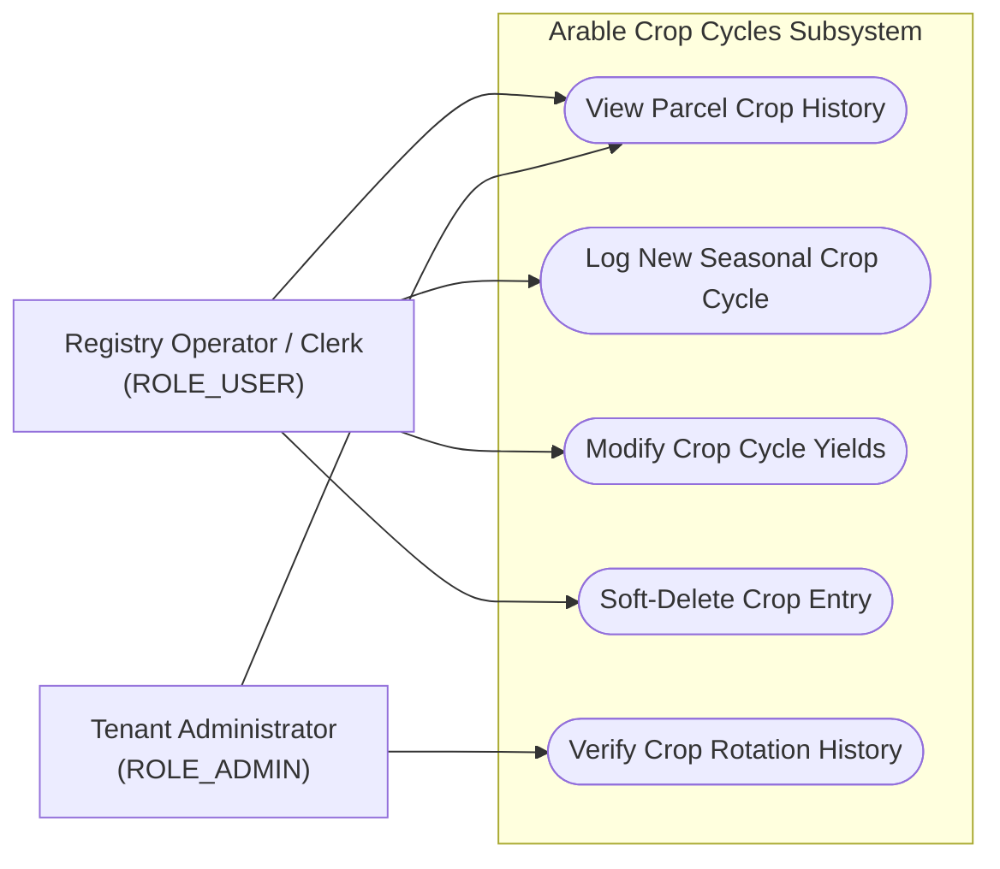
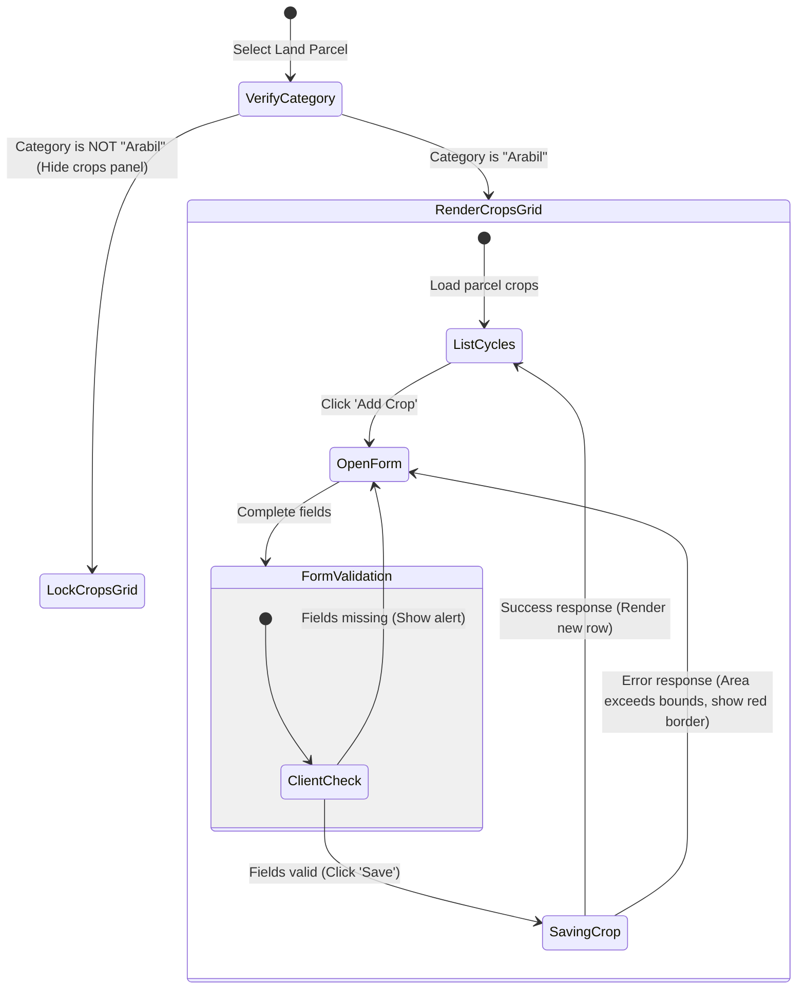
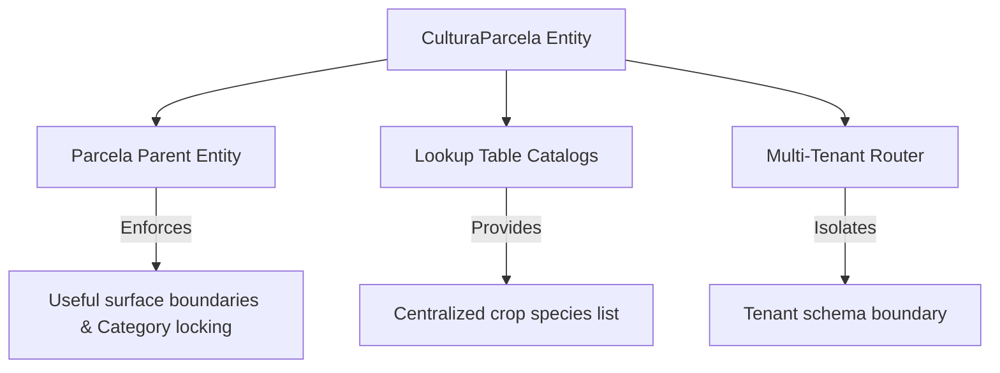

# Feature Specification: Arable Crop Cycles (Cultură Parcelă)

## 1. Business Purpose
The primary objective of the Arable Crop Cycles feature is to record, manage, and verify seasonal crop cultivations on arable land parcels. In Romania and the European Union, every municipality must track how agricultural lands are used. 

This feature serves critical administrative, subsidy, and regulatory compliance purposes:
* **APIA Subsidy Eligibility**: Romanian farmers rely on official certificates from the municipal agricultural registry to claim European APIA funding. The municipality must verify that crop declarations match actual arable land capacities before issuing these certifications.
* **Crop Rotation and Soil Health Compliance**: EU standards mandate crop rotation to prevent soil degradation. Historical crop logging allows local agricultural auditors to verify rotation compliance over multiple years.
* **Regional Production Estimations**: Aggregating seasonal crop logs helps municipal, county, and national planners estimate regional crop yields (e.g., wheat, maize, sunflower) and coordinate supply chain or food security policies.

---

## 2. Actor Goal Alignment Matrix

The Crop Cycle feature serves operators and inspectors engaged in municipal agricultural management:

| User Role | System Actions | Operational Goals | Trigger Event / Context |
| :--- | :--- | :--- | :--- |
| **ROLE_SUPER_ADMIN**  *(System Administrator)* | • Define dynamic seeding lookups for crop species. • Run cross-tenant crop reports. • Perform system-wide inspections. | Maintain dynamic data catalogs, monitor regional cultivation progress, and ensure global schema stability. | Triggered during national audits or system-wide data updates. |
| **ROLE_ADMIN**  *(Tenant Administrator)* | • Access and export local aggregated crop statistics. • Oversee clerk crop logging activities. • Audit historic rotation patterns. | Deliver accurate regional statistical reports to county-level authorities and manage clerk performance. | Triggered during annual reporting cycles or local disputes. |
| **ROLE_USER**  *(Operator / Clerk)* | • List crop histories for a specific parcel. • Log new crop cycles (sowing/harvesting). • Soft-delete erroneous entries. | Register citizen crop declarations, verify surface boundaries, and issue official activity certificates. | Triggered when a citizen declares seasonal crop yields or requests registry certificate extracts. |

### Use Case Diagram

---

## 3. Functional Description & Capabilities
The Crop Cycles module is a parcel-centric logging system. Within the platform, a **Parcelă (Land Plot)** serves as the physical parent entity. 

Key functional capabilities of this module include:
1. **Usage Category Locking (Arable Guard)**: Crop logs are strictly bound to land plots designated under the **"Arabil" (Arable Land)** category. If a parcel is classified as "Livadă" (Orchard), "Vii" (Vineyard), or "Pădure" (Forest), the crop logging panel is deactivated, preventing invalid data.
2. **Annual Agricultural Cycle Tracking**: Logs are structured by "Agricultural Year" (`anAgricol`), allowing clerks to catalog historical crop successions chronologically.
3. **Yield & Harvest Quantification**: Clerks record sowing/harvesting dates, average yield per hectare (in Kilograms), and consolidated total harvest weights (in Tons).
4. **Agronomic Environmental Context**: Captures soil types, irrigation methods, and preceding crop histories, ensuring full support for crop-rotation audit requirements.
5. **Soft Deletion Safety**: Deletions do not erase rows from the database. Instead, they activate a `deleted` flag. This hides the record from operators but preserves the revision audit trail.

---

## 4. Use Case Playbook & Scenarios

### Use Case 4.1: Log New Crop Cycle on Arable Plot
* **Primary Actor**: Municipal Clerk (`ROLE_USER`)
* **Pre-conditions**: Clerk has opened a valid household, navigated to the "Terenuri Agricole" tab, and selected an "Arabil" parcel.
* **Post-conditions**: The crop cycle is validated, linked to the active parcel, saved in the database, and rendered.

#### A. Standard Success Path (Happy Path)
1. The clerk clicks on Parcel #15 (`categorieFolosinta = 'arabil'`).
2. The UI detects the "Arabil" category and displays the "Crops (Culturi)" grid showing historical cycles.
3. The clerk clicks "Adaugă Cultură" (Add Crop).
4. The system opens the crop form, pre-populating the **An Agricol** with the current year (*2026*) and **Cultivated Surface Area** with the parcel's maximum area (*2.5 Ha*).
5. The clerk selects **Porumb (Maize)** from the Crop Species dropdown.
6. The clerk enters: Sowing Date (*12.04.2026*), Harvest Date (*15.09.2026*), Soil Type (*Cernoziom*), Irrigation (*None*), and Preceding Crop (*Grâu*).
7. The clerk inputs Yield/Ha (*5,200 Kg*) and Total Harvest (*13 Tons*).
8. The clerk clicks "Salvează".
9. The backend validates that all mandatory fields are present, ensures the cultivated surface area does not exceed the parcel's maximum boundary, saves the record, and returns `201 Created`.
10. The UI closes the form and refreshes the crop table.

#### B. Exception Path: Missing Mandatory Fields
* *At step 4*: The clerk leaves **Specie Cultură** or **Suprafață** empty and clicks "Salvează".
* *System Behavior*:
  1. The UI blocks submission and displays a browser alert: *“Completați anul agricol, specia și suprafața.”*
  2. The transaction is aborted. No data is sent to the server.

#### C. Exception Path: Surface Boundary Violation
* *At step 4*: The clerk enters a cultivated area of **3.5 Ha** on a parcel that only has a total surface of **2.5 Ha**.
* *System Behavior*:
  1. On submission, the backend detects the boundary mismatch (`suprafataCultivataHa > parcela.getSuprafata()`).
  2. The backend throws an exception, returning an HTTP `400 Bad Request` with the message: `"Suprafața cultivată depășește suprafața totală a parcelei (2.5 Ha)."`.
  3. The UI intercepts the error, stops the transaction, and displays a red border error alert with the backend message.

---

## 5. Comprehensive Data Dictionary

This table outlines the parameters managed by the Crop Cycles registry:

| Field Name (Logical) | Database Column | Data Type | Optionality | Validations & Business Rules |
| :--- | :--- | :--- | :--- | :--- |
| **Crop Log ID** | `id` | Long | **Mandatory** *(Auto)* | Primary key, automatically generated. |
| **Agricultural Year** | `an_agricol` | Integer | **Mandatory** | Sowing year. Must be a positive 4-digit integer (e.g., `2026`). |
| **Crop Species** | `specie_cultura` | String (100) | **Mandatory** | The physical crop planted. Cannot be blank. |
| **Cultivated Area** | `suprafata_cultivata_ha` | Double | **Mandatory** | Sown extent, measured in Hectares. Must be positive (`> 0`) and cannot exceed parent parcel size. |
| **Sowing Date** | `data_insamantare` | Date | *Optional* | Date when seeds were sown. Must not be in the future. |
| **Harvest Date** | `data_recoltare` | Date | *Optional* | Date when crops were harvested. Must be after the sowing date. |
| **Yield per Hectare** | `productie_hectar_kg` | Double | *Optional* | Sowing productivity, in Kilograms. Must be positive (`>= 0`). |
| **Total Production** | `productie_totala_tone` | Double | *Optional* | Consolidated yield, in Metric Tons. Must be positive (`>= 0`). |
| **Irrigation System** | `sistem_irigare` | String (100) | *Optional* | Irrigation infrastructure context. |
| **Soil Classification** | `tip_sol` | String (100) | *Optional* | Local pedological soil class. |
| **Preceding Crop** | `cultura_precedenta` | String (100) | *Optional* | Preceding cycle crop, used for crop-rotation audits. |

---

## 6. UI-UX Interaction & State Transitions

The state diagram maps how the crop panel opens, validates, and commits crop cycles:

### UX Design Rules:
* **Category Dependency Render**: The crops panel must be completely hidden if the selected parcel's usage category is not "Arabil". It must not appear disabled; it must be visually absent to reduce UI clutter.
* **Auto-Calculation Logic**: The form must include a micro-calculator. When the clerk inputs the Cultivated Area (`2.0`) and Yield/Ha (`5000`), the "Total Production" input field must automatically pre-populate with `10.0` Tons to minimize mental calculation errors.

---

## 7. Traceability Matrix & Dependencies

The Crop Cycles module relies on parcel mappings and multi-tenant database rules:

* **Parcel Parent Entity (`Parcela`)**: Holds the primary geographical coordinates, usage category, and total surface area boundaries.
* **Lookup catalogs (`tipuri_culturi`)**: Supplies the standardized crop species dropdown list from the global public schema.
* **Tenant Isolation**: When querying `/api/parcele/{id}/culturi`, the system applies schema isolation. This ensures clerks cannot access or alter crop registries belonging to adjacent administrative territories.

---

## 8. Non-Functional Requirements (NFRs)

* **Performance & Load Latency**:
  - Loading the crop cycle grid for a parcel must execute in **under 100ms**.
  - Form validations (such as checking area limits against the parent parcel size) must run on-the-fly inside the browser within **50ms**.
* **Soft Deletion & Audit Compliance**:
  - Deleted crop records must never be purged from the raw database. They must be preserved with `deleted = true` in support of historic agricultural audits.
* **Localization & Format Standards**:
  - All surface measurements are localized to **Hectares (Ha)**, using the Romanian decimal comma notation (e.g., `2,5 Ha` instead of `2.5 Ha`).
  - Production volumes must use **Kilograms (Kg)** for yield, and **Metric Tons (t)** for total production.
