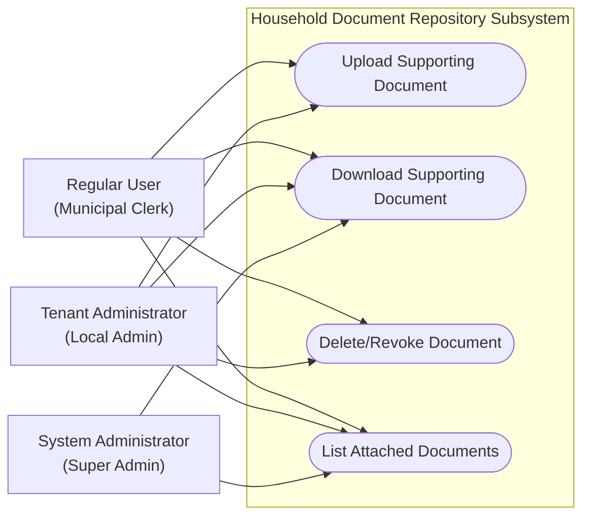
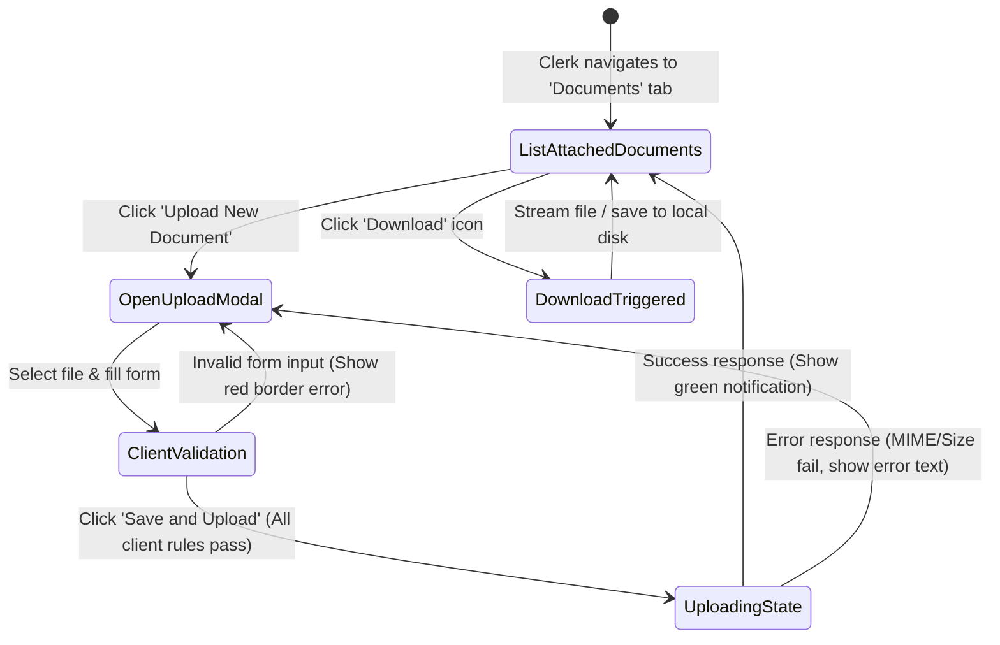

# Feature Specification: Household Document Repository

## 1. Business Purpose
The primary objective of the Household Document Repository is to bridge the gap between digital database entries and physical supporting documentation. In agricultural and municipal land registry management, every digital claim—such as land ownership, civil registration, crop declarations, or certificates—must be legally backed by physical supporting evidence (e.g., deed titles, ID copies, marriage or death certificates, or official contracts).

This feature solves the following business problems:
* **Legal and Audit Non-Compliance**: Municipalities are legally required to verify and store physical proof of citizen assertions before granting subsidies, agricultural certifications, or tax exemptions.
* **Administrative Latency**: Instead of clerks manually searching physical filing cabinets for paper supporting records, the digital repository stores files directly on-demand next to the household record.
* **Security & Misplacement Risks**: It eliminates the threat of misplacing high-stakes citizen documents by archiving digitized versions on secure, isolated, and backed-up servers.

---

## 2. Actors / Roles Involved
The document repository regulates user interactions across three standard roles:

| User Role | System Goals | Trigger Event / Context |
| :--- | :--- | :--- |
| **ROLE_SUPER_ADMIN** <br>*(Super Administrator)* | • Audit document folders across all tenant municipalities.<br>• Perform system-wide legal inspections.<br>• Download and verify files. | Triggered during central county-wide audits or legal inspections. |
| **ROLE_ADMIN** <br>*(UAT Administrator)* | • Manage, view, upload, and delete documents for the active UAT.<br>• Monitor compliance and storage spaces.<br>• Oversee clerk uploads. | Triggered during internal municipal reviews, local audits, or administrative evaluations. |
| **ROLE_USER** <br>*(Operator / Municipal Clerk)* | • Upload supporting files during citizen declarations.<br>• Retrieve and download files for verification.<br>• Remove outdated or incorrect documents. | Triggered when a citizen declares new data (e.g., buying land, declaring crops, birth of a member). |

### Use Case Diagram



---

## 3. Functional Description
The Document Repository is a decentralized, household-centric digital filing subsystem. Every document uploaded to the platform is structurally bound to a single parent **Gospodărie (Household)** profile.

Key functional capabilities include:
1. **Categorized Document Attachment**: Clerks must categorize every document under a standard descriptor (e.g., Property Title, Identity Document, Civil Status Document, Producer License) to ensure the registry remains organized and searchable.
2. **Standard Document Details**: Along with the physical file, clerks record key administrative details: the date of issue, the document's expiration date (especially critical for documents that expire, such as ID cards or producer licenses), and descriptive comments explaining the document's relevance.
3. **Secure Streaming Download**: Users can download and inspect files. The server streams the file directly with appropriate headers, allowing immediate viewing (for PDFs and images) or secure local saving.
4. **Physical Soft Deletion**: When an operator deletes a document, the system removes the database reference and physical file to respect storage constraints, but logs the action under GDPR audit records to maintain full accountability.

---

## 4. Use Case Playbook & Scenarios

### Use Case 10.1: Upload Supporting Document
* **Primary Actor**: Municipal Clerk (`ROLE_USER`)
* **Pre-conditions**: The clerk is authenticated, operates within an active UAT context (e.g., `uat_cluj`), and has navigated to a valid household file.
* **Post-conditions**: The physical file is safely stored, the metadata is saved, and a GDPR audit log is written.

#### A. Standard Success Path (Happy Path)
1. The clerk clicks the "Documents" tab on the Household dashboard.
2. The system fetches and renders the list of already attached documents.
3. The clerk clicks the "Upload New Document" button.
4. The system opens the upload modal.
5. The clerk selects the **Document Type** from a dropdown list (e.g., *Atestat Producător*).
6. The clerk enters the **Issue Date** (*2026-01-15*), **Expiration Date** (*2027-01-15*), and adds observations (*"Producer certificate copy"*).
7. The clerk drags and drops a valid PDF file (*atestat_pancu.pdf*, size 2.4 MB) into the upload area.
8. The clerk clicks "Save and Upload".
9. The backend validates that the file is under 10MB, is a permitted MIME type, sanitizes the filename to `atestat_pancu.pdf`, prepends a unique UUID, and copies the file to the host storage folder under `/data/documents/[household_id]/`.
10. The backend saves the database record, commits the transaction, and returns a `200 OK` response.
11. The frontend modal closes, displays a success notification (*"Documentul a fost încărcat cu succes!"*), and refreshes the document table.

#### B. Alternative Flow: Document with No Expiration Date
* *At step 6*: The document being uploaded is a permanent Property Deed (*Titlu de Proprietate*) which does not expire.
* *Flow*: The clerk leaves the **Expiration Date** field empty. The system accepts the empty value, mapping it as `null` in the database, meaning the document is marked as permanently valid.

#### C. Exception Path: Invalid File Type (MIME)
* *At step 7*: The clerk attempts to upload a spreadsheet file (*tabel_surse.xlsx* or *script_calcul.exe*).
* *System Behavior*:
  1. Upon clicking "Save and Upload", the backend intercepts the request inside `DocumentService.validateFile`.
  2. The service detects that the file's MIME type is not in the allowed set (PDF, JPEG, PNG, DOC, DOCX).
  3. The service throws a `ResponseStatusException` with HTTP Status `400 Bad Request` and the error message: `"Tip de fișier nepermis"`.
  4. The transaction is aborted. No file is copied, and no database record is created.
  5. The frontend intercepts the error and displays a red warning alert: *“Eroare la încărcarea documentului: Tip de fișier nepermis”*.

#### D. Exception Path: File Size Exceeded
* *At step 7*: The clerk attempts to upload a high-resolution scan of a property map (*harta_cadastru.tiff*, size 14.5 MB).
* *System Behavior*:
  1. The backend detects that the file size exceeds `MAX_FILE_SIZE_BYTES` (10,485,760 bytes).
  2. The service throws an HTTP `400 Bad Request` with the error message: `"Fișierul depășește dimensiunea maximă admisă (10MB)"`.
  3. The upload is blocked, and a red notification is shown to the clerk.

---

## 5. Comprehensive Data Dictionary

This table defines every data field managed by the Document Repository module:

| Field Name (Logical) | Database Column | Data Type | Optionality | Validations & Business Rules |
| :--- | :--- | :--- | :--- | :--- |
| **Document ID** | `id` | Long | **Mandatory** *(Auto)* | Primary key, automatically generated by the database. |
| **Household ID** | `gospodarie_id` | Long | **Mandatory** | Foreign key linking the document to its parent household (`Gospodarie`). Must exist. |
| **Document Type ID** | `tip_document_id` | Integer | **Mandatory** | Foreign key pointing to the central lookup table for document types. |
| **Original Filename** | `nume_fisier` | String (255) | **Mandatory** | Stores the original filename for user reference (e.g., `deed.pdf`). |
| **Storage Path** | `cale_stocare` | String (512) | **Mandatory** | Absolute path on the server where the file is stored. Must start with `/data/documents/[household_id]/`. |
| **MIME Type** | `mime_type` | String (100) | **Mandatory** | Extracted from the uploaded file. Must be: `application/pdf`, `image/jpeg`, `image/png`, `application/msword`, or `application/vnd.openxmlformats-officedocument.wordprocessingml.document`. |
| **Size (KB)** | `dimensiune_kb` | Integer | **Mandatory** | Calculated on upload: `file.getSize() / 1024`. Used for storage quotas. |
| **Issue Date** | `data_emitere` | Date | *Optional* | The date the document was legally issued. Cannot be in the future. |
| **Expiration Date** | `data_expirare` | Date | *Optional* | The date the document ceases to be legally valid. Must be after the Issue Date. |
| **Observations** | `observatii` | Text | *Optional* | Free-text field for clerk notes or certificate numbers. |
| **Uploader User ID** | `uploaded_by_id` | Long | **Mandatory** | Automatically set to the ID of the authenticated user who uploaded the file. |
| **Is Active** | `este_activ` | Boolean | **Mandatory** | Defaults to `true`. Used to temporarily suspend or archive documents. |

---

## 6. UI-UX Interaction & State Transitions
The frontend document panel implements dynamic interaction designs:



### UX Design Rules:
* **Drag-and-Drop Area**: The upload modal must present a distinct dashed dropzone. When a file is hovered over the dropzone, the area transitions to a semi-transparent blue tint with a subtle scale-up animation.
* **Form Field Validations**:
  - Expiration Date picker is disabled unless an Issue Date is selected. Once an Issue Date is chosen, the Expiration Date picker prevents the clerk from selecting any date prior to the Issue Date.
  - If a file over 10MB is dropped, the save button is immediately disabled, and a bold red validation text is shown below the input: *"Fișierul selectat depășește limita de 10MB"* (The file is not even sent to the server).
* **Downloading Feedback**: While the server fetches and streams the binary content, a subtle loading spinner replaces the download icon to prevent multiple concurrent download clicks on the same file.

---

## 7. Traceability Matrix & Dependencies

The Document Repository relies on the following core platform features:

```mermaid
graph TD
    A[Document Repository] --> B[@TenantRequired Guard]
    A --> C[@GdprAudited Aspect]
    A --> D[Gospodarie Primary Entity]
    A --> E[Tip Document Lookups]
    B -->|Enforces| F[Active UAT isolated database schema]
    C -->|Generates| G[Central gdpr_audit_logs in public schema]
    E -->|Bypasses active schema| H[Fetched from public.tipuri_documente]
```

* **Dynamic Multi-Tenancy (`@TenantRequired`)**: When querying or uploading files, the database transaction alters the `search_path` to point to the active tenant schema (e.g., `uat_cluj`). This ensures a clerk from Cluj can never query, download, or delete a document belonging to a household in Turda, even if they guess the database IDs.
* **GDPR Audit Trail (`@GdprAudited(entity = "Document")`)**:
  - Listing documents triggers a `VIEW` audit log with the list of returned document IDs.
  - Uploading a document triggers a `CREATE` audit log with the new document ID.
  - Downloading a document triggers a `VIEW` audit log capturing the specific file ID.
  - Deleting a document triggers a `DELETE` audit log capturing the deleted ID.
* **Lookup Catalog Bypass**: The document type select options are fetched by explicitly prefixing the table with `public.tipuri_documente`, bypassing the active tenant search path and fetching centralized, standardized classification lists.
* **Path Traversal Protection**: The system normalizes the target path and checks that it starts with the designated `/data/documents/[household_id]` folder. This protects the host server from malicious clerks attempting to delete core operating system files via directory traversal attacks.
