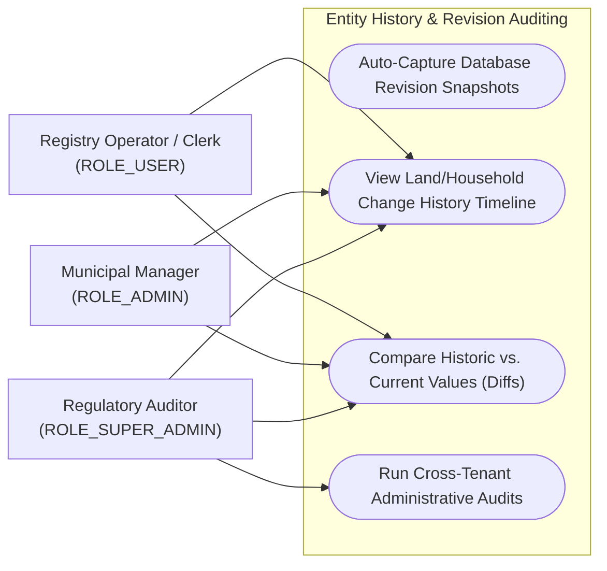
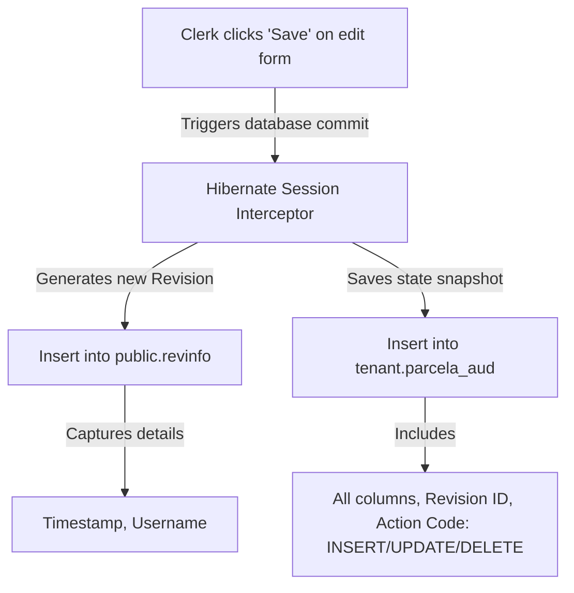

# Feature Specification: Entity History Tracking (Hibernate Envers)

## 1. Business Purpose
The primary objective of the Entity History Tracking feature is to maintain a **complete, chronological, and detailed audit trail** of all modifications made to core agricultural registry records. 

In municipal administration, land parcels, building configurations, and personal profiles are subject to frequent administrative modifications. For example:
* A parcel's useful area might be adjusted following a new topographic measurement.
* A citizen's registration details may change after a marriage or relocation.
* An producer's certificate status might be suspended.

In the event of legal or administrative disputes (such as overlapping land claims, inheritance contestations, or disputes over agricultural subsidy declarations), the municipality must be able to:
1. Identify **which clerk** modified or deleted a record.
2. Determine **the exact timestamp** of the change.
3. Compare the **previous state** of the record against its updated state to view the exact changes.
4. Access **deleted historical records** that are no longer active in the current database state.

This feature uses **Hibernate Envers** to automatically record snapshots of database changes, protecting the municipality against administrative liability and human input errors.

---

## 2. Actors / Roles Involved
Entity History Tracking provides clear benefits across different levels of municipal administration:

| stakeholder | Business Goals | System Interaction |
| :--- | :--- | :--- |
| **Registry Operators & Clerks** <br>*(ROLE_USER)* | • View change logs for land plots to understand discrepancies in land measurements.<br>• Identify who updated or registered specific properties. | Query history files directly from the land parcel or household dashboard to check details. |
| **Municipal Managers** <br>*(ROLE_ADMIN)* | • Resolve ownership and boundary disputes with accurate change logs.<br>• Investigate erroneous or suspicious edits made by operators.<br>• Access soft-deleted data. | Access a comprehensive history panel that details previous vs. new values for audited tables. |
| **Regulatory Inspectors** <br>*(ROLE_SUPER_ADMIN)* | • Conduct forensic evaluations during state-level investigations.<br>• Verify the historical integrity of municipal registries. | Run system-wide history logs across multiple municipality databases. |

### Use Case Diagram



---

## 3. Functional Description: The Snapshot Auditing Model
The history tracking system operates transparently using **Hibernate Envers**. Any core registry table annotated with `@Audited` is mirrored by a matching shadow table suffixed with `_aud` (e.g., `gospodarie_aud`, `parcela_aud`, `persoana_aud`).



### Core Auditing Rules:
1. **Atomic Commits**: Auditing is fully integrated into the core database transaction. If the main update fails, the audit snapshot is discarded, ensuring data remains consistent.
2. **User Binding**: Every revision is automatically linked to the logged-in user via a custom `RevisionListener` (`CustomRevisionListener`), which queries Spring Security during the transaction commit.
3. **Excluding Static Lookups**: Audited transactional entities often link to static lookup tables (such as crop types, animal species, or county list lookups). To prevent database bloat and schema-dependency issues, these global catalogs are excluded using `@Audited(targetAuditMode = RelationTargetAuditMode.NOT_AUDITED)`. This ensures only the *link* (the foreign key ID) is audited, without replicating static lookup tables.

---

## 4. Use Case Playbook & Scenarios

### Use Case 13.1: Modify Land Parcel Surface Area
* **Primary Actor**: Municipal Clerk
* **Pre-conditions**: Clerk has opened a household's land plot list and selects a land parcel (ID: 45) to edit.
* **Post-conditions**: The updated parcel details are saved, and a revision is saved to the history tables.

#### A. Standard Success Path (Happy Path)
1. The clerk clicks "Edit" on Land Parcel ID #45.
2. The system displays a form pre-populated with the current values: Useful Area: *1,500 sqm*, Crop Category: *Wheat*, Coordinates: *Stereo70 X=342000, Y=567000*.
3. The clerk updates the Useful Area to **1,800 sqm** and enters a note: *"Updated based on cadastre measurement"*.
4. The clerk clicks "Save Changes".
5. The backend executes `PUT /api/parcele/45`.
6. Envers intercepts the update:
   - It inserts a row into the central `revinfo` table, capturing the revision number `142`, epoch timestamp `1783512345000` (translated to *2026-07-08 11:21:04*), and the clerk's username `clerk_maria`.
   - It inserts a row into `parcela_aud` with the updated area of `1800` and notes, setting `revtype = 1` (indicating an UPDATE).
7. The transaction commits, and a success alert is shown: *"Modificările au fost salvate cu succes!"*.

---

### Use Case 13.2: Inspect Revision History
* **Primary Actor**: Municipal Manager
* **Pre-conditions**: Manager opens a parcel's details to resolve an area dispute and clicks the "History" tab.
* **Post-conditions**: The system queries revisions, calculates field differences, and displays a clean timeline of changes.

#### A. Standard Success Path (Happy Path)
1. The manager navigates to Parcel ID #45 and clicks the "History" tab.
2. The frontend triggers `GET /api/parcele/45/history`.
3. The backend initialized an `AuditReader` and queries the database for all revisions of Parcel #45.
4. The backend compares each revision against its predecessor to compute the field-level differences:
   - Revision 120 (Author: `patrik_clerk`, Action: `CREATE`): Initial creation of the parcel (Area: 1,500 sqm).
   - Revision 142 (Author: `maria_clerk`, Action: `UPDATE`): Changed Useful Area from *1,500 sqm* to *1,800 sqm*.
5. The backend compiles the data into `ParcelaRevisionDto` objects and returns a JSON payload.
6. The frontend renders a clean, chronological timeline showing exactly what changed, when, and by whom.

---

## 5. Comprehensive Data Dictionary

### A. Central Revision Table (`public.revinfo`)
Defines the global revision log, centralized in the public schema to ensure chronological consistency across all tenants:

| Field Name | Database Column | Data Type | Optionality | Purpose |
| :--- | :--- | :--- | :--- | :--- |
| **Revision ID** | `rev` | Integer | **Mandatory** *(Auto)* | Sequential, unique ID generated for each database transaction. |
| **Timestamp** | `revtstmp` | Long | **Mandatory** | The millisecond epoch timestamp when the transaction committed. |
| **Username** | `username` | String (255) | **Mandatory** | The username of the user who committed the change. Defaults to `"anonymous"`. |

### B. Shadow Audit Table Structure (Example: `tenant.parcela_aud`)
Tracks the historical snapshots of modified records alongside revision metadata:

| Field Name | Database Column | Data Type | Optionality | Purpose |
| :--- | :--- | :--- | :--- | :--- |
| **Parcel ID** | `id` | Long | **Mandatory** | The ID of the land parcel. Used to group revisions for a specific record. |
| **Useful Area** | `suprafata_utila_mp` | Double | *Optional* | The historical value of the parcel's surface area. |
| **Revision ID** | `rev` | Integer | **Mandatory** | Foreign key linking the snapshot to its metadata in `public.revinfo`. |
| **Revision Type** | `revtype` | Smallint | **Mandatory** | Indicates the action: `0` (INSERT), `1` (UPDATE), or `2` (DELETE). |

---

## 6. UI-UX Audit Trail Timeline
The "Istoric Modificări" panel displays changes using a clean, visual timeline:

```
+-----------------------------------------------------------------------------+
|  AUDIT TIMELINE: LAND PLOT #45                                              |
+-----------------------------------------------------------------------------+
|                                                                             |
|  [o] UPDATE - 2026-07-08 11:21:04 by maria_clerk                            |
|      -----------------------------------------------------------------      |
|      Field                | Previous Value       | New Value                |
|      ---------------------+----------------------+--------------------      |
|      Useful Area (sqm)    | 1,500                | 1,800                    |
|      -----------------------------------------------------------------      |
|                                                                             |
|  [o] CREATE - 2026-05-02 09:15:30 by patrik_clerk                           |
|      Record established with Useful Area: 1,500 sqm                         |
|                                                                             |
+-----------------------------------------------------------------------------+
```

### UX Styling Rules:
* **Diff Highlighting**:
  - Unchanged values are displayed in standard dark gray text.
  - Decreases in numerical values are displayed in a light red box (e.g., area reduced from 5,000 to 4,000).
  - Increases in numerical values are displayed in a light green box (e.g., area expanded from 1,500 to 1,800).
* **Collapsible Timeline Items**: Revisions are displayed in a collapsible tree. Clicking a revision expands it to show the detailed field comparison table.

---

## 7. Traceability Matrix & Non-Functional Requirements

### Non-Functional Requirements (NFRs):
* **Audit Footprint**: Shadow history tables must only replicate transactional tables (not lookup tables), maintaining storage overhead under **25%** of the primary database size.
* **Transactional Atomicity**: The generation of history logs must occur within the primary database transaction. If the main transaction fails or rolls back, the revision must be aborted.
* **History Retrieve Latency**: Querying and computing differences for up to 50 revisions of an entity must resolve in **under 200ms**.

### Platform Dependencies:
* **Hibernate Envers (`@Audited`)**: Core engine handles database triggers and shadow table synchronization.
* **CustomRevisionListener**: Extracts security credentials from `SecurityContextHolder` to bind the clerk's username to the transaction revision.
* **Audit Reader API**: Utilized in backend services (e.g., `ParcelaService.getParcelaHistory`) to perform structural history queries.
