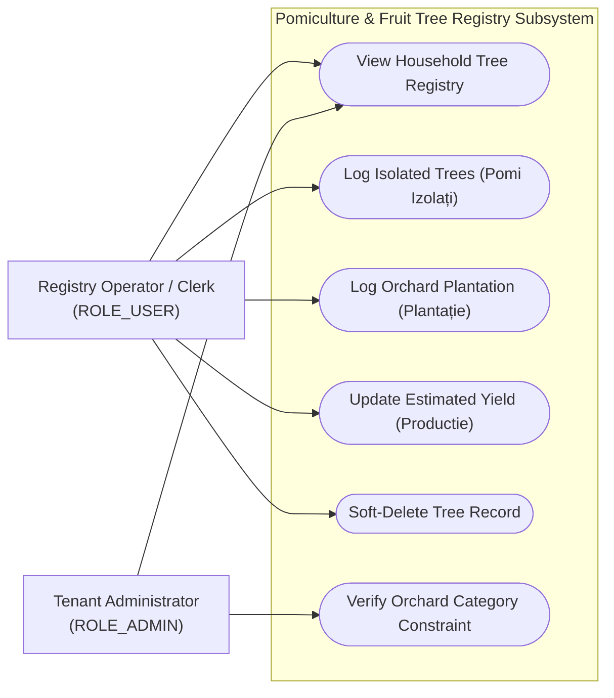
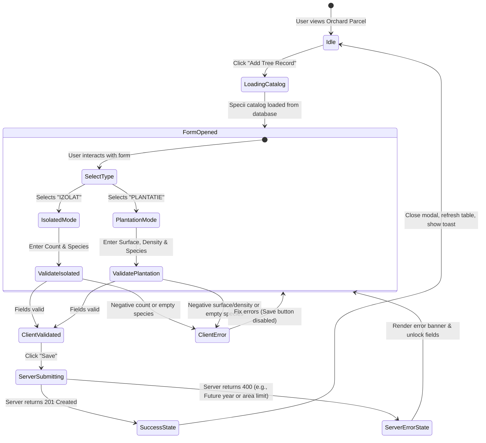
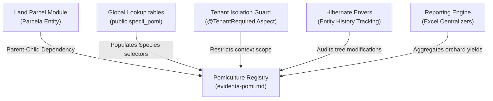

# Feature Specification: Pomiculture & Fruit Tree Registry (Evidență Pomi)

## 1. Business Purpose
The primary objective of the Pomiculture and Fruit Tree Registry feature is to record, manage, and verify fruit tree stocks and commercial plantations within the municipality's households. 

In municipal administration, tracking pomiculture assets is a key regulatory, statistical, and economic requirement:
* **APIA Subsidy Verification**: Farmers claiming European Union and national agricultural subsidies (such as APIA funding in Romania) must prove eligibility. Subsidies are heavily regulated based on land categories, tree species, active densities (trees per hectare), and plantation statuses. The municipality must verify and certify these parameters before certificates are issued.
* **National Agricultural Compliance**: Under Romanian agricultural registry regulations, municipalities are legally mandated to maintain accurate annual counts of fruit-bearing trees, categorized by species (e.g., Apple, Pear, Plum, Walnut) and health conditions.
* **Economic and Ecological Planning**: Consolidated reports help local, county, and national planners estimate regional fruit production capacity, analyze regional agricultural diversification, and coordinate ecological or irrigation assistance.

This solves critical administrative challenges:
* **Fraudulent Subsidy Claims**: Prevents farmers from declaring high-density commercial orchards on residential yards, pasture, or forestry plots to illegally claim premium orchard subsidies.
* **Data Fragmentation**: Eliminates manual, error-prone paper tallies by maintaining structured, queryable digital files bound to specific topographic plots.
* **Historical Loss**: Uses persistent records to track the aging of regional orchards, predicting when specific orchards will enter declining production phases.

---

## 2. Actor Goal Alignment Matrix

The Pomiculture Registry serves operators and auditors involved in municipal agricultural management:

| User Role | System Actions | Operational Goals | Trigger Event / Context |
| :--- | :--- | :--- | :--- |
| **ROLE_SUPER_ADMIN** <br>*(System Administrator)* | • Define global reference catalogs of allowed fruit species.<br>• Run aggregated regional pomiculture reports.<br>• Inspect cross-tenant database constraints. | Ensure standardized agricultural classifications across all municipalities and maintain system-wide reference directories. | Triggered during national catalog updates or cross-municipality compliance audits. |
| **ROLE_ADMIN** <br>*(Tenant Administrator)* | • Access and export local aggregated tree counts and orchard statistics.<br>• Oversee clerk recording activities.<br>• Audit local pomiculture declarations. | Verify municipal statistical reports, export certified files to the County Directorate for Agriculture (DAJ), and resolve disputes. | Triggered during annual reporting cycles or local agricultural boundary disputes. |
| **ROLE_USER** <br>*(Operator / Clerk)* | • List pomiculture records for a specific household.<br>• Add, edit, or soft-delete tree records (Isolated/Plantation).<br>• Log annual crop yield estimations. | Register farmer declarations, verify crop-category constraints, and issue official land registry extract certificates. | Triggered when a citizen declares new plantings, reports annual yields, or requests certificate extracts. |

### Use Case Diagram



---

## 3. Functional Description & Capabilities
The Pomiculture module operates as a specialized, context-aware submodule under the Land Registry. Within the platform, a **Parcelă (Land Plot)** serves as the physical parent entity.

Key functional capabilities include:
1. **Orchard Category Guard (Category Locking)**: Fruit tree records can *only* be associated with land plots officially registered under the **"Livadă" (Orchard)** category of use. If a plot is registered as "Arabil" (Arable), "Păşune" (Pasture), or "Fânețe" (Meadow), the pomiculture entry system is deactivated. This prevents clerical errors and ensures database integrity.
2. **Dual-Mode Registration**: The system handles two distinct biological tracking styles:
   * **Isolated Trees (Pomi Izolați)**: Scattered, non-commercial trees (typically in residential yards). The primary metric is the absolute physical count of trees (`numar_pomi`).
   * **Plantations (Plantații Pomicole)**: Structured, commercial orchards. The primary metrics are the absolute covered surface area in hectares (`suprafata_ha`) and planting density per hectare (`densitate_pomi_ha`).
3. **Biological Phase Classification**: Tracks tree development stages: *Tânăr* (Young/non-bearing), *Pe Rod* (Active bearing/yielding), and *Îmbătrânit* (Declining/senescent).
4. **Annual Production Logs**: Allows operators to record annual harvested weights (in Kilograms) to feed into regional productivity indexes.
5. **Soft-Delete Preservation**: Standard deletions do not erase database rows. A `deleted = true` flag is set, hiding the record from the UI while preserving the historical audit trail.

---

## 4. Use Case Playbook & Scenarios

### Use Case 6.1: Log New Fruit Tree Entry (Isolated Mode)
* **Primary Actor**: Municipal Clerk (`ROLE_USER`)
* **Pre-conditions**: Clerk has opened a valid household, navigated to the "Terenuri" tab, and selected a parcel designated as "Livadă" (`categorieFolosinta = 'livada'`).
* **Post-conditions**: The isolated tree record is validated, linked to the parcel, and saved.

#### A. Standard Success Path (Happy Path)
1. The clerk clicks on Parcel #42 (validated as "Livadă").
2. The UI detects the category and unlocks the "Pomi Fructiferi" (Fruit Trees) tab.
3. The clerk clicks "Adaugă Înregistrare" (Add Record).
4. The clerk selects **IZOLAT (Isolated)** as the Registration Type.
5. The UI dynamically disables and hides the "Surface (HA)" and "Density" fields, leaving "Number of Trees" active.
6. The clerk selects **Prun (Plum)** from the Species dropdown and types **Stanley** in the Variety field.
7. The clerk inputs: Tree Count (*15*), Planting Year (*2022*), Health State (*Pe Rod*), and Irrigation (*None*).
8. The clerk clicks "Salvează".
9. The backend validates the inputs, associates the record with Parcel #42, saves the entry, and returns `201 Created`.
10. The UI refreshes the tree table and shows a success notification: *"Datele au fost înregistrate cu succes!"*.

#### B. Exception Path: Negative Tree Count
* *At step 7*: The clerk types `-15` in the Tree Count field and clicks "Salvează".
* *System Behavior*:
  1. The Angular reactive form detects the negative value, outlines the field in red, and displays: *"Numărul de pomi trebuie să fie un număr pozitiv."*.
  2. The "Salvează" button is disabled. No request is sent.
  3. If bypassed, the backend validation catches the rule violation and rejects the query with an HTTP `400 Bad Request` and the message: `"Numărul de pomi trebuie să fie mai mare decât zero."`.

---

### Use Case 6.2: Log New Fruit Tree Entry (Plantation Mode)
* **Primary Actor**: Municipal Clerk (`ROLE_USER`)
* **Pre-conditions**: Clerk is on an orchard parcel's tree entry form.
* **Post-conditions**: The plantation record is validated, density is checked, and saved.

#### A. Standard Success Path (Happy Path)
1. The clerk clicks "Adaugă Înregistrare".
2. The clerk selects **PLANTATIE (Plantation)** as the Registration Type.
3. The UI dynamically shows and mandates the "Surface (HA)" and "Density (Trees/HA)" fields.
4. The clerk selects **Măr (Apple)** as the Species and types **Golden** as the Variety.
5. The clerk inputs: Surface Area (*1.2 Ha*), Planting Density (*800 trees/Ha*), Planting Year (*2020*), Health State (*Pe Rod*), Maintenance System (*Ecologic*), and Irrigation (*Picurare*).
6. The clerk clicks "Salvează".
7. The backend verifies that the declared surface area (*1.2 Ha*) does not exceed the parent parcel's total surface area (*1.5 Ha*).
8. The backend saves the plantation record and returns `201 Created`.
9. The UI refreshes and closes the modal.

#### B. Exception Path: Plantation Surface Exceeds Parcel Surface
* *At step 5*: The clerk enters a plantation surface of **2.0 Ha** on a parcel that only has a total surface of **1.5 Ha**.
* *System Behavior*:
  1. Upon clicking "Salvează", the backend dynamic validation engine triggers a comparison: `suprafataHa > parcela.getSuprafata()`.
  2. The backend aborts the transaction and returns HTTP `400 Bad Request` with the message: `"Suprafața plantației (2.0 Ha) depășește suprafața totală a parcelei (1.5 Ha)."`.
  3. The UI catches the error and displays a prominent red warning message to the clerk.

---

### Use Case 6.3: Update Estimated Crop/Yield
* **Primary Actor**: Municipal Clerk (`ROLE_USER`)
* **Pre-conditions**: An active pomiculture record exists.
* **Post-conditions**: Harvest production data is updated.

#### A. Standard Success Path (Happy Path)
1. The clerk clicks "Editează" next to an Apple Plantation record.
2. The clerk inputs **12,500 Kg** in the "Producție Estimată (Kg)" field.
3. The clerk clicks "Salvează".
4. The backend validates the positive weight, commits the update, and returns `200 OK`.

#### B. Exception Path: Future Planting Year Entered
* *At step 1*: The clerk edits the record and inputs a future year (e.g., `2029`) as the planting year.
* *System Behavior*:
  1. The backend intercepts the transaction and validates the year boundary against the current system year (`anPlantare > currentYear`).
  2. The backend rejects the change with an HTTP `400 Bad Request` and the message: `"Anul plantării nu poate fi în viitor."`.
  3. The UI alerts the clerk, preventing invalid historical data.

---

## 5. Comprehensive Data Dictionary

This table defines the properties managed by the Pomiculture subsystem:

| Field Name (Logical) | Database Column | Data Type | Optionality | Validations & Business Rules |
| :--- | :--- | :--- | :--- | :--- |
| **Pomiculture Log ID** | `id` | Long | **Mandatory** *(Auto)* | Primary key, automatically generated. |
| **Registration Type** | `tip_inregistrare` | Enum / String | **Mandatory** | Allowed values: `IZOLAT` (Isolated) or `PLANTATIE` (Plantation). Determines UI field toggles. |
| **Tree Species** | `specie` | String (100) | **Mandatory** | Must reference active values in `public.specii_pomi` (e.g., *Măr*, *Păr*, *Prun*, *Nuc*, *Cireș*). |
| **Variety / Cultivar** | `soi` | String (100) | Optional | Text descriptor of fruit variety (e.g., *Jonathan*, *Stanley*). |
| **Planting Year** | `an_plantare` | Integer | **Mandatory** | Must be a positive 4-digit integer. Cannot exceed the current calendar year. |
| **Tree Count** | `numar_pomi` | Integer | **Mandatory if `IZOLAT`** | Must be a strictly positive integer (`> 0`). Hidden/ignored for Plantations. |
| **Orchard Area** | `suprafata_ha` | Double | **Mandatory if `PLANTATIE`** | Must be a positive double (`> 0.00`). Cannot exceed the parent `Parcela` surface area. |
| **Planting Density** | `densitate_pomi_ha`| Integer | **Mandatory if `PLANTATIE`** | Must be a positive integer representing trees/Ha. |
| **Physiological State** | `stare_pomi` | String (50) | **Mandatory** | Standard development phases: `TANAR` (Young), `PE_ROD` (Bearing), `IMBATRANIT` (Declining). |
| **Maintenance Style** | `sistem_intretinere`| String (100) | Optional | Description of farming practices (e.g., *Ecologic*, *Convențional*). |
| **Irrigation Type** | `sistem_irigare` | String (100) | Optional | Water supply description (e.g., *Picurare*, *Aspersiune*, *Fără*). |
| **Estimated Yield** | `productie_estimata`| Double | Optional | Estimated annual production in Kilograms. Must be positive or zero. |
| **Observations** | `observatii` | String (500) | Optional | General administrative annotations. |
| **Soft Delete Status** | `deleted` | Boolean | **Mandatory** *(Auto)* | Default is `false`. Soft-delete indicator. |

---

## 6. UI/UX Interaction & State Transitions

### Visual Layout & Wireframe Representation
The Pomiculture management interface is housed within the "Parcelă" detail pane:
```
+------------------------------------------------------------------------------------+
|  PARCEL #42 - LIVADĂ (ORCHARD) - 1.50 HA                                           |
+------------------------------------------------------------------------------------+
|  [Details]   [Crops (Locked)]   [*Fruit Trees (Pomi)*]   [Owners]   [History]      |
+------------------------------------------------------------------------------------+
|  +------------------------------------------------------------------------------+  |
|  | REGISTERED FRUIT TREES                                 [+ Add Tree Record]   |  |
|  +------------------------------------------------------------------------------+  |
|  | Type       | Species | Variety | Plant Year | Count | Area (Ha) | Yield (Kg)|  |
|  +------------+---------+---------+------------+-------+-----------+-----------+  |
|  | IZOLAT     | Prun    | Stanley | 2022       | 15    | ---       | 450 Kg    |  |
|  | PLANTATIE  | Măr     | Golden  | 2020       | ---   | 1.20 Ha   | 12500 Kg  |  |
|  +------------------------------------------------------------------------------+  |
+------------------------------------------------------------------------------------+
```

### Mermaid State Diagram



---

## 7. Traceability Matrix & Dependencies

The Pomiculture Registry integrates with several core system components to maintain security, compliance, and reporting:



### Dependency Narrative:
1. **Land Parcel Module (`Parcela`)**: Direct parent-child dependency. Fruit trees cannot exist without a topographic plot anchor. The system reads the parent parcel's use category (`Livadă`) to toggle access to the entire subsystem.
2. **Global Lookups**: Queries `public.specii_pomi` to populate dropdown selections, enforcing standardized national agricultural names (e.g., *Măr*, *Prun*) and preventing inconsistent spellings.
3. **Tenant Security Guard**: Wraps all controller requests with `@TenantRequired`, ensuring that operators from one town hall cannot access, modify, or download pomiculture data from another town hall.
4. **Hibernate Envers**: Logs changes made to tree records in shadow `pomi_aud` tables, linking each adjustment to the responsible clerk's username and timestamp.
5. **Excel Export Engine**: Sums active tree quantities and orchard surfaces, outputting these statistics directly to official zootechnical/vegetal reporting spreadsheets.

---

## 8. Non-Functional Requirements (NFRs)

* **UI Latency Budget**: Form type toggling (Isolated vs. Plantation) must occur instantaneously in the client browser without triggering server round-trips. Database-driven lookup loading must complete in **under 150ms**.
* **Data Security & Privacy**: Pomiculture records contain agricultural assets linked to private citizen households. Data is strictly isolated at the database schema layer per tenant, preventing cross-town data leaks.
* **High-Volume Data Auditing**: Since orchards are subject to national subsidy audits, any manual modification of tree entries must be captured by Hibernate Envers with sub-second timestamps.
* **Romanian Localization Conventions**:
  * **Area Formatting**: Surfaces are registered in Hectares with two decimal precision (e.g., `1.25 Ha` or `0.50 Ha`).
  * **Weight Unit Standards**: Yields are input and displayed in Kilograms (Kg) for individual records and automatically aggregated into metric Tonnes (T) on central statistical exports.
  * **Naming**: The UI must display Romanian terms (*Izolat*, *Plantație*, *Tânăr*, *Pe Rod*, *Îmbătrânit*, *Specie*, *Soi*), while the backend maintains standard technical maps.
