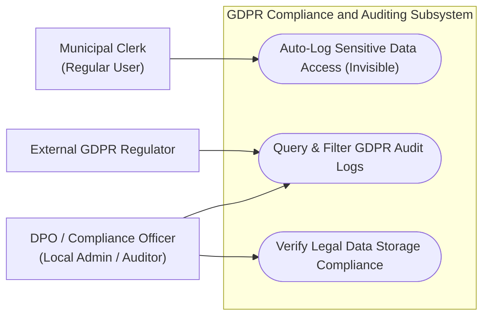
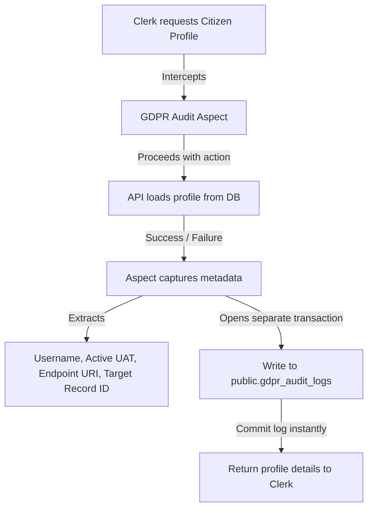

# Feature Specification: GDPR Compliance Access and Audit Logging

## 1. Business Purpose
The primary objective of the GDPR Compliance Access and Audit Logging feature is to enforce strict data governance and transparency as mandated by the **European Union General Data Protection Regulation (GDPR)** and local national data privacy legislations. 

In public administration, the agricultural land registry handles highly sensitive personal data. This includes:
* Unique Personal Identification Numbers (CNP for physical persons, CUI for legal entities).
* Full residential addresses, contact details, and financial assets.
* Civil status, kinship relations, and family history logs.
* Property ownership deeds, certificates, and land boundaries.

Under data protection laws, citizens have a right to know who accessed their personal records, and public institutions are legally required to maintain unalterable records of all operations on personal data. This feature provides a **non-bypassable, automated, and tamper-proof security ledger** that logs every view, creation, modification, or deletion of sensitive personal files.

This solves the following business risks:
* **Insider Data Leakage**: Deters clerks from performing unauthorized queries on citizens (e.g., searching for neighbors, public figures, or relatives out of curiosity).
* **Audit Non-Compliance**: Protects the municipality from massive regulatory fines by proving that access to citizen data is always logged and strictly justified by official duties.
* **Administrative Repudiation**: Prevents an operator from denying they performed a specific action (such as modifying land plots or deleting records), as every action is bound to their personal account.

---

## 2. Actors / Roles Involved
GDPR auditing serves different organizational roles to maintain compliance and transparency:

| Role / stakeholder | Compliance Goals | System Interaction |
| :--- | :--- | :--- |
| **Citizens** <br>*(Data Subjects)* | • Guarantee that their private, personal data is kept secure.<br>• Know exactly which civil clerks accessed their folders. | External beneficiaries. They do not interact with the system but can request access reports. |
| **Municipal Clerks** <br>*(Data Processors)* | • Access and process citizen files strictly to perform their official duties.<br>• Accountable for every lookup or modification. | Subject to continuous, automated, and invisible logging on all sensitive routes. |
| **Compliance / Security Officers** <br>*(Data Protection Officers - DPO)* | • Inspect audit trails to identify suspicious search spikes.<br>• Run reports to verify that data is processed lawfully. | Utilize a read-only compliance panel to query logs by user, date range, or citizen ID. |
| **External Regulators** <br>*(GDPR Auditors)* | • Verify that the platform implements robust "Privacy by Design" principles.<br>• Run independent audits. | Review system audit table architectures and verify transactional non-repudiation during audits. |

### Use Case Diagram



---

## 3. Functional Description: Automated AOP Auditing
The GDPR Audit Logging subsystem operates on the principle of **Aspect-Oriented Programming (AOP)**. Rather than relying on individual developers to manually add logging code inside hundreds of API endpoints, the system implements a centralized auditing aspect.

Any controller or service method handling sensitive data is decorated with a custom `@GdprAudited` annotation (e.g., `@GdprAudited(entity = "Persoana")`). When an endpoint is called, the aspect intercepts the action, runs the core business operation, and then records the transaction metadata.



### Key Compliance Rules:
1. **Invisibility**: Clerks have no visibility into the logging system. The audit runs silently in the background and cannot be paused or disabled.
2. **Immutability (Write-Only)**: The system permits **only inserts** into the GDPR audit table. There is no update or delete API, and the database schema restricts write privileges on the audit log table to prevent tampering—even by local database administrators.
3. **centralization**: Audit logs are written to the centralized `public` schema rather than individual tenant schemas. This prevents tenant administrators from clearing their own logs and enables consolidated, multi-municipality compliance reporting.

---

## 4. Comprehensive Data Dictionary

This table defines the structure of the `public.gdpr_audit_logs` table:

| Field Name | Database Column | Data Type | Optionality | Compliance & Audit Purpose |
| :--- | :--- | :--- | :--- | :--- |
| **Audit Log ID** | `id` | Long | **Mandatory** *(Auto)* | Primary key. Used to identify the sequential order of access events. |
| **Timestamp** | `timestamp` | Instant (UTC) | **Mandatory** | The exact date and millisecond when the access took place. |
| **Utilizator (User)** | `utilizator` | String (255) | **Mandatory** | The username of the logged-in user (e.g., `maria_clerk`). Defaults to `"anonymous"` if unauthenticated. |
| **Tip Acțiune** | `tip_actiune` | Enum (String) | **Mandatory** | Maps to standard actions: `VIEW`, `CREATE`, `UPDATE`, or `DELETE`. |
| **Entitate Vizată** | `entitate_vizata` | String (255) | **Mandatory** | The type of sensitive resource accessed (e.g., `Persoana`, `Gospodarie`, `Document`). |
| **Target Citizen ID** | `id_persoana_vizata` | String (1024) | *Optional* | Stores the unique ID of the citizen or entity accessed. For lists or paginated views, it records all retrieved IDs as a stringified list (e.g., `[101, 102, 103]`). |
| **API Endpoint** | `endpoint` | String (512) | **Mandatory** | The specific URL invoked (e.g., `/api/persoane/gospodarie/45`), showing the exact context of the query. |
| **Tenant ID** | `tenant_id` | String (100) | **Mandatory** | The active municipal schema identifier (e.g., `uat_cluj`), proving under which municipality context the action was conducted. |

---

## 5. UI-UX Compliance Auditing Interface
While clerks have no access to the logs, Compliance Officers (`ROLE_ADMIN` with special audit rights) utilize a specialized **GDPR Log Review Portal**.

```
+------------------------------------------------------------------------------------+
|  GDPR COMPLIANCE LOG VIEWER                                                        |
+------------------------------------------------------------------------------------+
|  [ Operator: [maria_clerk   ] ]  [ Action: [UPDATE  v] ]  [ Target ID: [1042   ] ] |
|  [ Date Range: 2026-07-01 to 2026-07-08 ]                 [ Search Logs ]          |
+------------------------------------------------------------------------------------+
| Timestamp            | Operator     | Action | Target Entity | Targeted IDs | UAT  |
+----------------------+--------------+--------+---------------+--------------+------+
| 2026-07-08 11:21:04  | maria_clerk  | UPDATE | Persoana      | [1042]       | cluj |
| 2026-07-08 09:15:30  | maria_clerk  | VIEW   | Document      | [15]         | cluj |
+----------------------+--------------+--------+---------------+--------------+------+
| Show 10 per page                                              Page [1] of 42  >    |
+------------------------------------------------------------------------------------+
```

### UI Rules:
* **No Edit/Delete Controls**: The compliance table is strictly read-only. It has no edit, modify, or delete buttons.
* **Target ID Highlight**: Clicking on an entry in the "Targeted IDs" column opens a pop-up summarizing the citizen's basic name and CNP, allowing inspectors to quickly identify whose records were accessed without leaving the audit panel.

---

## 6. Traceability Matrix & Non-Functional Requirements

### Non-Functional Requirements (NFRs):
* **Non-Repudiation (Propagation Rule)**: Audit log saves must use `@Transactional(propagation = Propagation.REQUIRES_NEW)`. This guarantees that even if the primary business operation fails, the audit log runs in a separate connection and commits independently.
* **Zero Performance Footprint**: Intercepting and logging requests must add **no more than 10ms** of latency to the primary API request.
* **Storage Immutability**: The database user account used by the Spring Boot application must only have `INSERT` and `SELECT` permissions on `public.gdpr_audit_logs`. `UPDATE` and `DELETE` queries on this table must be blocked at the database engine level.

### Dependencies:
* **Spring AOP (AspectJ)**: Intercepts methods decorated with `@GdprAudited`.
* **Spring Security Context**: Resolves user authentication details via `SecurityContextHolder.getContext().getAuthentication()`.
* **Multi-Tenant Context Tracker**: Provides the active tenant identifier from `TenantContext.getCurrentTenant()`.
