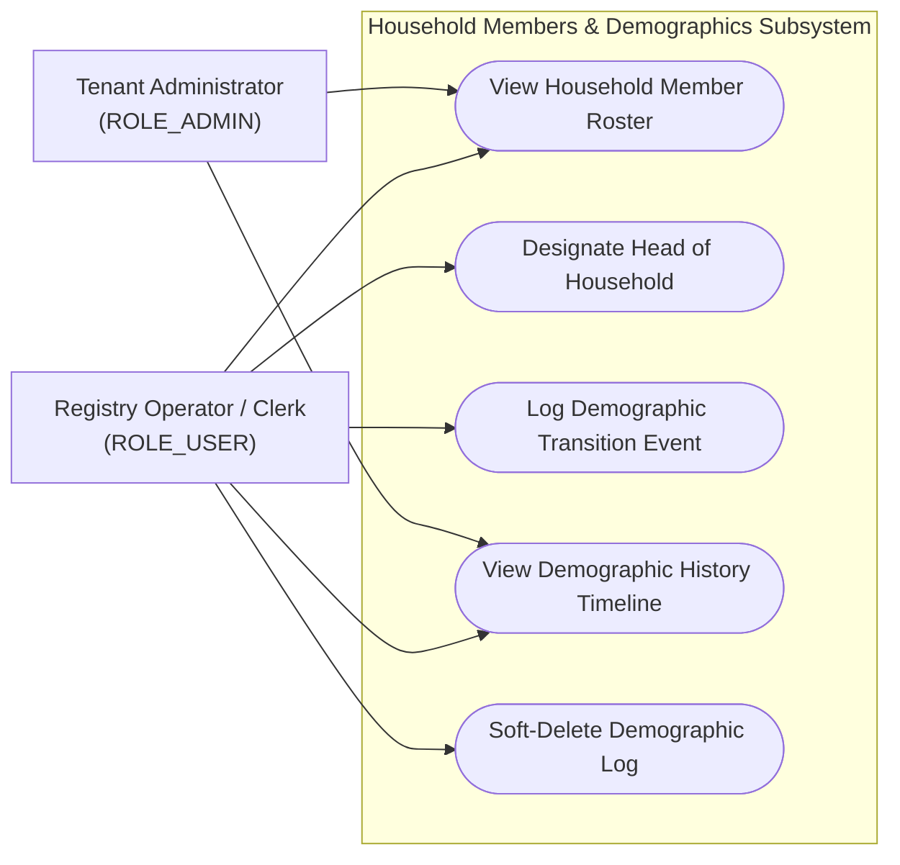
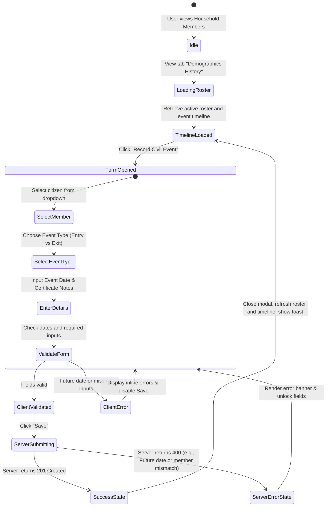
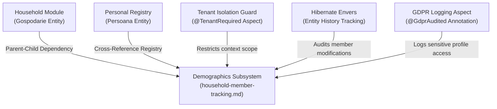

# Feature Specification: Household Members & Legal Representation

## 1. Business Purpose
The primary objective of the Household Members and Legal Representation feature is to manage the human and demographic composition of the agricultural household (*Gospodărie*).

An agricultural household is more than just a collection of land plots and livestock; it is a human, demographic, and economic unit. In public administration, tracking household membership is critical for several administrative, legal, and statistical reasons:
* **Legal Representation**: A household must have a single, clearly designated representative who serves as the primary signatory for official agricultural declarations, land claims, and registry extracts.
* **Succession and Inheritance Rights**: Maintaining a detailed, certified history of family compositions provides a reliable legal record to resolve property disputes and inheritance claims.
* **Subsidy Eligibility & Social Aid**: Access to specific agricultural subsidies, ecological grants, or municipal social aid is often determined by the total headcount and demographic status of the household members.
* **Demographic Census Reporting**: The municipality relies on consolidated household rosters to generate demographic statistics (such as birth, mortality, and relocation rates) for county and national planning.

This solves critical administrative challenges:
* **Conflicting Representation Claims**: Prevents family disputes by enforcing a singular, legally-binding representative ("Cap de Gospodărie") in the digital registry.
* **Historical Membership Tracking**: Replaces static, flat rosters with a chronological timeline of demographic events, recording how and why members join or leave the household.

---

## 2. Actor Goal Alignment Matrix

The demographics and household membership subsystem serves operators and municipal administrators:

| User Role | System Actions | Operational Goals | Trigger Event / Context |
| :--- | :--- | :--- | :--- |
| **ROLE_SUPER_ADMIN** <br>*(System Administrator)* | • Audit global demographic database schemas.<br>• Perform forensic data recovery of soft-deleted records. | Ensure global database stability, verify schema boundaries, and conduct system-wide compliance checks. | Triggered during national audits, system upgrades, or emergency data recovery requests. |
| **ROLE_ADMIN** <br>*(Tenant Administrator)* | • Review demographic statistics and census-level reports.<br>• Resolve representation or membership disputes. | Provide verified demographic statistics to county authorities and oversee local clerk activities. | Triggered during quarterly census compilations or local land disputes. |
| **ROLE_USER** <br>*(Operator / Clerk)* | • List household member rosters and historical timelines.<br>• Record demographic transition events.<br>• Designate or reassign the Head of Household. | Register citizen declarations, maintain clean family rosters, and issue official certified extracts. | Triggered when a citizen declares births, marriages, relocations, deaths, or changes in legal representation. |

### Use Case Diagram



---

## 3. Functional Description & Capabilities
The demographics and household membership subsystem organizes the human component of the agricultural registry through two key components:

### 1. Head of Household Representation ("Cap de Gospodărie")
To prevent administrative and legal confusion, the system enforces singular representation:
* **Singular Direct Reference**: The household entity contains a single foreign key reference (`cap_gospodarie_id`) pointing to the designated representative's profile.
* **Clean Overwriting**: When an operator designates a new member as the head, the system updates the single reference, automatically and cleanly reassigning the legal representative role.
* **Integrity Guard**: Only active, registered members of the household can be designated as the head of household.

### 2. Demographic Transition History (`IstoricMembruGospodarie`)
Rather than maintaining a flat, static list of members, the system tracks the complete historical flow of household memberships. Whenever a member enters or exits a household, clerks record a formal demographic event:
* **Entry Events**:
  * `INTRARE_NASTERE` (Arrival by Birth)
  * `INTRARE_CASATORIE` (Arrival by Marriage)
  * `INTRARE_MUTARE` (Arrival by Relocation/Address Migration)
* **Exit Events**:
  * `IESIRE_DECES` (Departure by Death)
  * `IESIRE_DIVORT` (Departure by Divorce)
  * `IESIRE_MUTARE` (Departure by Relocation/Address Migration)
* **Other Event**:
  * `ALTELE` (General administrative modifications)

Each event captures the physical event date, the clerk's notes (such as birth/death certificate numbers, marriage certificates, or relocation decrees), and the responsible clerk's username, building a reliable administrative timeline.

---

## 4. Use Case Playbook & Scenarios

### Use Case 15.1: Designate New Head of Household
* **Primary Actor**: Municipal Clerk (`ROLE_USER`)
* **Pre-conditions**: Clerk has opened a valid household, navigated to the "Membri" (Members) tab, and selected a registered member (ID: `501`) to designate as the representative.
* **Post-conditions**: The system updates the legal representative reference, reassigning the primary household contact.

#### A. Standard Success Path (Happy Path)
1. The clerk opens Household #105 and goes to the "Membri" tab.
2. The roster displays three active members: Ion Popescu, Maria Popescu, and Vasile Popescu. The active head is Ion Popescu.
3. Due to Ion's retirement, the family declares Vasile Popescu as the new representative.
4. The clerk clicks "Desemnează Cap Gospodărie" (Designate Head of Household) next to Vasile's name.
5. The frontend dispatches a POST request: `POST /api/gospodarii/105/cap-gospodarie?persoanaId=501`.
6. The backend verifies that person ID `501` is an active member of Household #105.
7. The system updates the `capGospodarie` column on Household #105 to point to Vasile Popescu, commits the transaction, and returns `200 OK`.
8. The UI instantly updates, displaying Vasile Popescu with a bold "Cap de Gospodărie" badge.

#### B. Exception Path: Assign Non-Member as Head of Household
1. An operator attempts to bypass the UI and manually triggers a REST command: `POST /api/gospodarii/105/cap-gospodarie?persoanaId=999` (where person ID `999` belongs to a different household).
2. The backend service intercepts the transaction and performs a membership validation check.
3. The system detects that person ID `999` is not registered as an active member of Household #105.
4. The backend aborts the update and returns an HTTP `400 Bad Request` response with the message: `"Persoana selectată nu este membru activ al acestei gospodării."`.

---

### Use Case 15.2: Log Demographic Transition Event (Departure by Death)
* **Primary Actor**: Municipal Clerk (`ROLE_USER`)
* **Pre-conditions**: Clerk has opened a household member's profile.
* **Post-conditions**: The death event is recorded, and the member is marked as inactive in the active roster.

#### A. Standard Success Path (Happy Path)
1. The clerk navigates to the "Istoric Demografic" (Demographics History) panel inside Household #105.
2. The clerk clicks "Înregistrează Eveniment Demografic" (Record Demographic Event).
3. The clerk selects **Ion Popescu** as the target member.
4. The clerk selects **IESIRE_DECES** (Departure by Death) as the Event Type.
5. The clerk enters: Event Date (*05.07.2026*) and Certificate Details (*Death Certificate Series DR no. 123456*).
6. The clerk clicks "Salvează".
7. The backend validates that the event date is not in the future, records the history log, marks Ion Popescu as inactive in the active roster, and returns `201 Created`.
8. The household timeline updates, displaying the death event chronologically. Ion Popescu is removed from the active household roster.

#### B. Exception Path: Future Event Date Entered
1. At step 5, the clerk accidentally types a future date: `12.12.2029`.
2. Upon clicking "Salvează", the backend dynamic validation engine triggers a comparison: `dataEveniment > currentSystemDate`.
3. The backend aborts the transaction and returns HTTP `400 Bad Request` with the message: `"Data evenimentului demografic nu poate fi în viitor."`.
4. The UI intercepts the error and displays a red warning message.

---

## 5. Comprehensive Data Dictionary

This table defines the properties managed by the Household Members and Demographics subsystem:

| Field Name (Logical) | Database Column | Data Type | Optionality | Validations & Business Rules |
| :--- | :--- | :--- | :--- | :--- |
| **History Log ID** | `id` | Long | **Mandatory** *(Auto)* | Primary key, automatically generated. |
| **Parent Household ID**| `gospodarie_id` | Long | **Mandatory** | Foreign key linking the event to the parent household. |
| **Target Person ID** | `persoana_id` | Long | **Mandatory** | Foreign key linking the event to the target citizen. |
| **Event Type** | `tip_eveniment` | Enum / String | **Mandatory** | Standard codes: `INTRARE_NASTERE`, `INTRARE_CASATORIE`, `INTRARE_MUTARE`, `IESIRE_DECES`, `IESIRE_DIVORT`, `IESIRE_MUTARE`, `ALTELE`. |
| **Event Date** | `data_eveniment` | Date | **Mandatory** | Must represent a logical past or current date. Cannot be set in the future. |
| **Observations / Notes**| `observatii` | String (500) | Optional | Text block storing certificate numbers, decrees, or clerical context. |
| **Soft Delete Status** | `deleted` | Boolean | **Mandatory** *(Auto)* | Default is `false`. Soft-delete status indicator. |
| **Head of Household ID**| `cap_gospodarie_id`| Long | Optional | Single, nullable foreign key reference on the `gospodarie` table. |

---

## 6. UI/UX Interaction & State Transitions

### Visual Layout & Timeline Representation
The demographics interface provides an interactive timeline showing the membership lifecycle:
```
+------------------------------------------------------------------------------------+
|  HOUSEHOLD #105 - MEMBERS & DEMOGRAPHICS HISTORY                                   |
+------------------------------------------------------------------------------------+
|  [Active Roster]   [*Demographics Timeline*]   [Lands]   [Livestock]   [Documents] |
+------------------------------------------------------------------------------------+
|  CHRONOLOGICAL HISTORY TIMELINE                        [+ Record Civil Event]      |
|                                                                                    |
|  (x) 05.07.2026 - Ion Popescu: DEPARTURE BY DEATH                                  |
|                  * Death Certificate Series DR no. 123456 | Recorded by clerk_maria|
|                                                                                    |
|  (o) 12.04.2020 - Vasile Popescu: ARRIVAL BY MARRIAGE                              |
|                  * Marriage Certificate no. 4829 | Recorded by clerk_maria         |
|                                                                                    |
|  (*) 01.01.2015 - Household established with Ion Popescu as Cap de Gospodărie      |
+------------------------------------------------------------------------------------+
```

### Mermaid State Diagram



---

## 7. Traceability Matrix & Dependencies

The Demographics and Household Membership subsystem is integrated with security, compliance, and auditing modules:



### Dependency Narrative:
1. **Core Entities**: Connects Household (*Gospodărie*) and Person (*Persoană*) entities to track membership changes chronologically.
2. **Tenant Isolation Guard**: Wraps all demographics controller requests with `@TenantRequired`, ensuring that operators from one town hall cannot view or modify household member details from another town.
3. **GDPR Auditing Subsystem**: Tracks access to demographic records. Any view, search, or modification of citizen profiles (containing sensitive CNPs, addresses, and kinship details) is logged in the central auditing ledger.
4. **Hibernate Envers**: Logs changes made to demographic events in shadow `istoric_membru_aud` tables, linking each adjustment to the responsible clerk's username and timestamp.

---

## 8. Non-Functional Requirements (NFRs)

* **UI Latency Budget**: Dynamic form validation (such as checking date boundaries) must occur instantaneously in the client browser without triggering server round-trips. Roster and timeline loading must complete in **under 200ms**.
* **Data Security & Privacy (GDPR Compliance)**: Demographic logs contain highly sensitive personal and civil status details (CNPs, kinship, marriage/death details). Data must be strictly isolated at the database schema layer per tenant, preventing cross-town leaks.
* **Forensic Audit Logs**: Since demographic data can impact land ownership and succession disputes, all manual modifications of demographic entries must be captured by Hibernate Envers with sub-second timestamps.
* **Consistent Localization**: The UI must display Romanian terms (*Cap de Gospodărie*, *Intrare*, *Ieșire*, *Deces*, *Căsătorie*, *Mutare*, *Data Evenimentului*), while the backend maintains standard technical maps.
