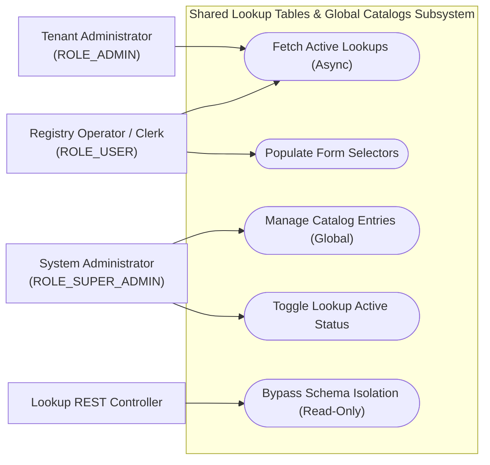
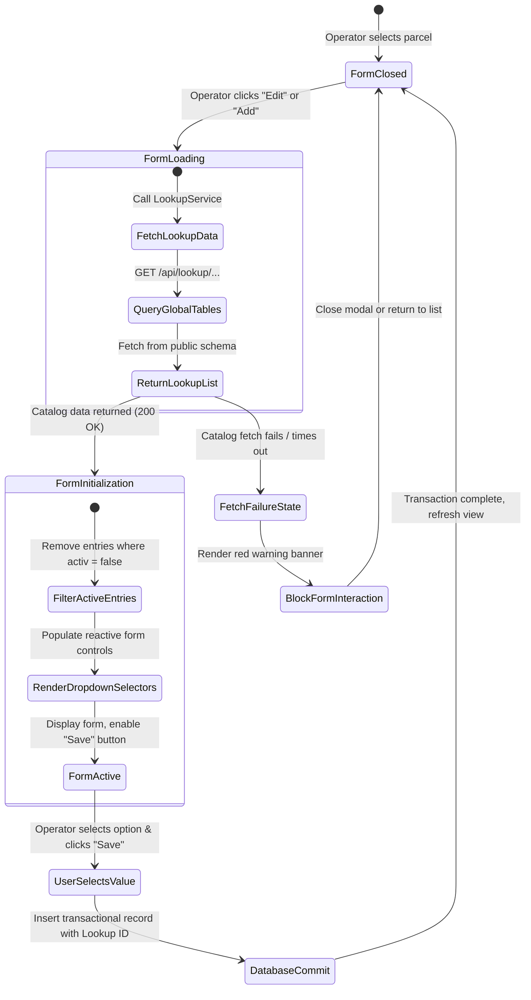
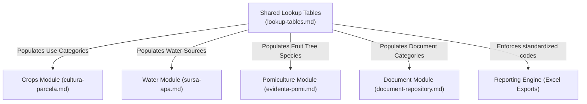

# Feature Specification: Shared Lookup Tables & Global Catalogs

## 1. Business Purpose
The primary objective of the Shared Lookup Tables and Global Catalogs feature is to replace hardcoded, static software classifications with dynamic, database-driven lookup tables stored in a shared global repository.

In a multi-tenant municipal software platform, using hardcoded lists (such as static lists of crop species, soil types, or document categories) poses major operational problems:
* **High Redeployment Costs**: Modifying, adding, or retiring an agricultural category would require a full software rebuild, testing cycle, and platform-wide redeployment. This introduces system downtime and administrative overhead.
* **Lack of Standardization**: Different municipalities might use inconsistent names or spellings for the same categories (e.g., "Măr", "Mere", "Pom-Mar"), corrupting consolidated national statistical reports.
* **Regulatory Compliance**: Romanian national authorities (such as APIA or INS) regularly update official agricultural, soil, and land classifications. The system must adapt to these legislative updates instantly.

By migrating these classifications to dynamic database tables stored in a centralized `public` schema, the system enforces a unified national standard across all municipal tenants while enabling administrators to update catalog options instantly with zero software downtime.

---

## 2. Actor Goal Alignment Matrix

The global catalog subsystem provides consistent reference data across all municipal operations:

| User Role | System Actions | Operational Goals | Trigger Event / Context |
| :--- | :--- | :--- | :--- |
| **ROLE_SUPER_ADMIN** <br>*(System Administrator)* | • Add, edit, or toggle the active status of entries in the global catalogs.<br>• Introduce new standardized national classifications. | Maintain global catalog consistency, manage official codes, and respond to legislative classification updates. | Triggered during national catalog revisions or legislative updates from agricultural ministries. |
| **ROLE_ADMIN** <br>*(Tenant Administrator)* | • Consume active lookup options in administrative forms.<br>• Review catalog-aligned statistics. | Monitor local registry alignment with national reporting standards and ensure clerks use valid options. | Triggered during regular data reviews or before exporting statistical reports. |
| **ROLE_USER** <br>*(Operator / Clerk)* | • Select validated options from dropdown lists in registration forms.<br>• View active catalog values. | Onboard and register agricultural assets quickly and accurately, with zero risk of making spelling or categorization errors. | Triggered during daily farmer interviews, data entry tasks, or profile creation sessions. |

### Use Case Diagram



---

## 3. Functional Description & Capabilities
The lookup table subsystem acts as a shared system-wide metadata service, utilizing explicit database schema-qualification to bypass standard tenant schema isolation:

### 1. Centralized Lookup API (`LookupController`)
The backend exposes dedicated, read-only GET endpoints to fetch active classifications for forms:
* **Soil Classification Profiles**: `/api/lookup/tip-sol`
* **Standardized Land Use Categories**: `/api/lookup/categorie-folosinta`
* **Water Source Infrastructure Types**: `/api/lookup/tip-sursa-apa`
* **Official Document Categories**: `/api/lookup/tip-document`
* **Pomicultural Tree Species**: `/api/lookup/specii-pomi`

### 2. Global Database Referencing (`public` Schema)
* **Bypassing Tenant Isolation**: Since the system is multi-tenant, queries are normally restricted to the active tenant schema. To ensure all municipalities use the exact same catalog codes, lookup queries use explicit schema-qualification, targeting the global `public` schema (e.g., `SELECT * FROM public.specii_pomi`).
* **Clean Joins**: Transactional tables inside tenant schemas refer to these global tables using standardized integer IDs or mnemonic codes.

### 3. Catalog Lifecycle & Dynamic Deactivation (`activ` Flag)
To prevent database corruption, lookups utilize an active status flag:
* **Dynamic Deactivation**: If an official document type or agricultural category is retired, a Super Admin sets its `activ` flag to `false`.
* **Zero Historical Corruption**: Obsolete options are instantly hidden from new form selectors. However, historical records that reference these lookup IDs remain fully valid and readable, preserving data integrity.

---

## 4. Use Case Playbook & Scenarios

### Use Case 10.1: Load Form with Dynamic Lookup Selectors
* **Primary Actor**: Municipal Clerk (`ROLE_USER`)
* **Pre-conditions**: Clerk has opened a registration form (e.g., "Add Fruit Tree" on an orchard plot).
* **Post-conditions**: Dropdown selectors are populated with active, validated options fetched from the database.

#### A. Standard Success Path (Happy Path)
1. The clerk clicks "Adaugă Înregistrare" (Add Record).
2. The Angular form component invokes the `LookupService`.
3. The browser dispatches an asynchronous GET request to `/api/lookup/specii-pomi`.
4. The backend intercepts the request and queries the global `public.specii_pomi` table, bypassing tenant schema isolation.
5. The database returns the list of active fruit species (e.g., *Măr*, *Păr*, *Prun*, *Nuc*, *Cireș*).
6. The frontend hides the loading spinner and populates the dropdown selector.
7. The clerk selects a certified species and completes the registration with 100% compliant data.

#### B. Exception Path: Lookup Server Fetch Failure
1. At step 3, a network disruption occurs, and the lookup request fails or times out.
2. The Angular component catches the HTTP error, stops form initialization, and displays a prominent warning banner: *"Nu s-au putut încărca categoriile din catalogul național. Reîncărcați pagina."* (Could not load categories from the national catalog. Please refresh the page).
3. The dropdown selectors remain locked with a red outline, and the "Save" button is disabled to prevent unclassified data entries.

---

### Use Case 10.2: Deactivate Catalog Lookup Item
* **Primary Actor**: System Administrator (`ROLE_SUPER_ADMIN`)
* **Pre-conditions**: System Administrator has authenticated and accesses the Global Catalog Editor.
* **Post-conditions**: A catalog entry is deactivated, hiding it from future entries while preserving historical records.

#### A. Standard Success Path (Happy Path)
1. The Super Admin selects the Document Classifications catalog (`public.tip_document`).
2. The Super Admin locates an obsolete document code: `CERTIFICAT_PROVIZORIU` (Provisional Certificate).
3. The Admin deselects the "Activ" checkbox and clicks "Salvează".
4. The backend updates the record in `public.tip_document`, setting `activ = false`, and returns `200 OK`.
5. The next time a municipal operator opens the "Upload Document" form, the provisional certificate option is hidden from the dropdown.
6. A historical household profile that uploaded a provisional certificate in 2024 still displays the document name correctly, as the ID mapping remains intact.

#### B. Exception Path: Operator Attempts to Create a Lookup Entry
1. A municipal operator attempts to register a custom fruit species by manually sending a POST request to `/api/lookup/specii-pomi`.
2. The backend Spring Security filter detects that the operator lacks `ROLE_SUPER_ADMIN` privileges.
3. The request is instantly blocked, returning an HTTP `403 Forbidden` response. Lookup tables remain immutable for standard users.

---

## 5. Comprehensive Data Dictionary

This table defines the properties managed by the Lookup Table framework:

| Field Name (Logical) | Technical Column Reference | Data Type | Optionality | Validations & Business Rules |
| :--- | :--- | :--- | :--- | :--- |
| **Lookup Item ID** | `id` | Integer | **Mandatory** | Primary key. Used as a foreign key in transactional tables. |
| **Unique Code** | `cod` | String (50) | **Mandatory** | Mnemonic catalog code (e.g., `ACT_PROPRIETATE`, `TIP_LUT`). Must be unique. |
| **Description** | `denumire` | String (255) | **Mandatory** | Human-readable Romanian label displayed in UI selectors (e.g., *Act de Proprietate*, *Cernoziom*). |
| **Active Status** | `activ` | Boolean | **Mandatory** | Flag indicating catalog status. If `false`, the item is hidden from active form dropdowns. |

---

## 6. UI/UX Interaction & State Transitions

### Visual Dropdown Interaction Rules
* **Asynchronous Loading**: While lookup lists are being fetched, dropdown selectors display a loading spinner and placeholder text: *"Se încarcă catalogul..."* (Loading catalog...).
* **Fallback Selection**: If a form references a deactivated lookup entry, the UI displays the historical value with an explanatory label: *"Arhivă - [Denumire]"*, preventing data loss.

```
+------------------------------------------------------------------------------------+
|  ADD SOIL DETAILS                                                                  |
+------------------------------------------------------------------------------------+
|  Select Soil Type: [ Se încarcă catalogul... (Spinner)                            ] |
|                                                                                    |
|  Select Soil Type: [ Chernozem (Cernoziom)                                      |v] |
|                    | Chernozem (Cernoziom)                                         | |
|                    | Clay (Argilos)                                                | |
|                    | Sandy (Nisipos)                                               | |
|                    +---------------------------------------------------------------+ |
+------------------------------------------------------------------------------------+
```

### Mermaid State Diagram



---

## 7. Traceability Matrix & Dependencies

The Shared Lookup Tables are highly integrated with all transactional registries in the system:



### Dependency Narrative:
1. **Core Transactional Registries**: Every data entry form in the system depends on the lookup subsystem to load validated options.
2. **PostgreSQL Connection Provider**: Dynamic multi-tenancy isolates database connections, but explicit `public.` schema-qualification allows lookups to bypass this schema separation, providing a centralized data repository.
3. **Excel Reporting Engine**: The Excel Export Engine relies on standardized lookup codes to group, aggregate, and summarize regional statistics, ensuring clean data exports.

---

## 8. Non-Functional Requirements (NFRs)

* **Performance Budget**: Lookup API endpoints must respond in **under 100ms** under normal load.
* **Aggressive Caching**: Since global catalogs are modified infrequently, lookup lists should be cached in-memory on the backend and client-side (via Angular service caching) to minimize database query overhead.
* **Standardized Schema Scoping**: All database lookup tables must reside in the global `public` schema and remain read-only for standard municipal operator accounts, protecting against unauthorized modifications.
