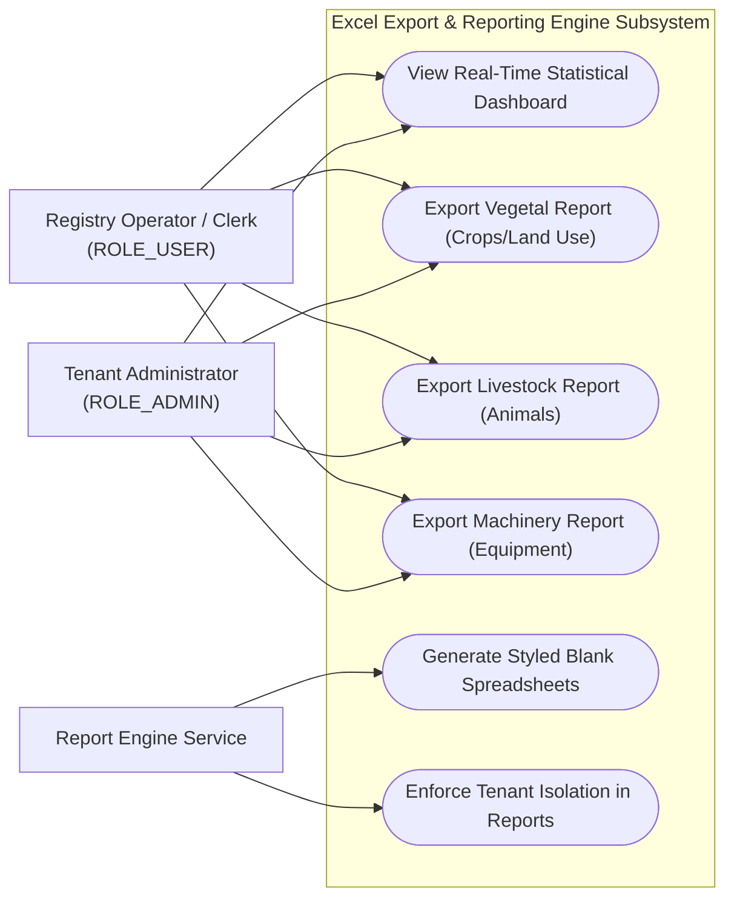
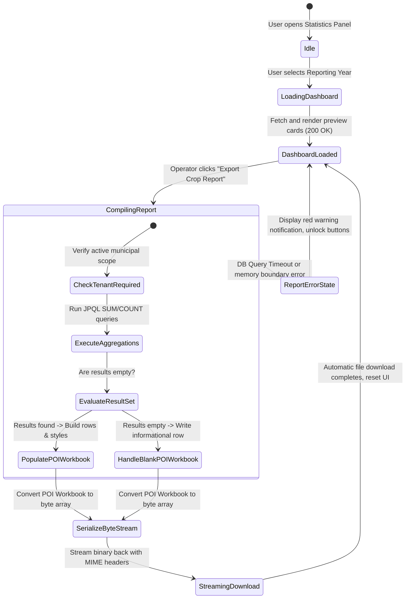
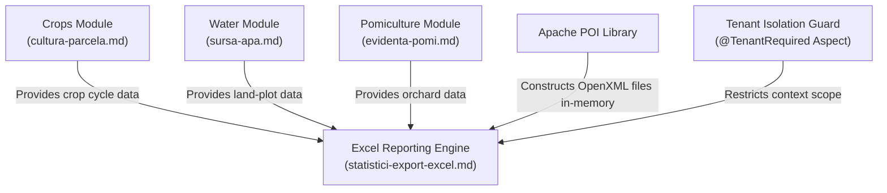

# Feature Specification: Excel Export & Reporting Engine

## 1. Business Purpose
The primary objective of the Excel Export and Reporting Engine feature is to automate the compilation of consolidated statistical reports of municipal agricultural assets.

In municipal public administration, local town halls are legally required to report aggregated agricultural statistics to regional and national agencies:
* **Governmental Reporting Compliance**: Regular schedules mandate submitting detailed summaries of local crop surface areas, estimated harvest yields, livestock numbers, and agricultural machinery to the County Directorate for Agriculture (DAJ), the National Institute of Statistics (INS), and agricultural subsidy agencies (APIA).
* **Elimination of Labor-Intensive Processes**: Manually scanning thousands of physical or individual digital registry files to aggregate these figures is extremely time-consuming and prone to clerical calculation errors.
* **Economic Assessment**: Municipal administrators and local mayors require real-time, aggregated data to monitor regional productivity, plan irrigation networks, coordinate ecological support, and evaluate municipal agricultural outputs.

The Reporting Engine automates this compilation. With a single click, it executes dynamic, real-time aggregation queries across all household registries in the active municipal database and generates standardized, pre-formatted Excel centralizers ready for official submission.

---

## 2. Actor Goal Alignment Matrix

The Excel Export and Reporting Engine provides tailored reporting tools for administrators and inspectors:

| User Role | System Actions | Operational Goals | Trigger Event / Context |
| :--- | :--- | :--- | :--- |
| **ROLE_SUPER_ADMIN** <br>*(System Administrator)* | • Run aggregated agricultural exports across multiple municipalities.<br>• Monitor performance metrics of database aggregation queries. | Conduct high-level, cross-municipality agricultural assessments and ensure system-wide query performance. | Triggered during national audits, regional studies, or platform optimization sessions. |
| **ROLE_ADMIN** <br>*(Tenant Administrator)* | • Access and export local aggregated crop, livestock, and machinery reports.<br>• Review real-time statistical dashboards. | Oversee local municipal productivity, prepare certified agricultural dossiers, and export data for DAJ/INS reporting. | Triggered during quarterly or annual reporting cycles. |
| **ROLE_USER** <br>*(Operator / Clerk)* | • Select parameters (reporting years) and download pre-formatted Excel exports. | Compile and export official reports quickly, with 100% mathematical accuracy, to assist local farmers with their official dossiers. | Triggered when a county agency requests data or during regular reporting deadlines. |

### Use Case Diagram



---

## 3. Functional Description & Capabilities
The reporting engine provides an interactive real-time dashboard inside the user interface, alongside a dynamic Excel generation service powered by **Apache POI**:

### 1. High-Performance Real-Time Aggregation
* **Live Calculations**: Rather than relying on stale cached values or scheduled summary tables, the system calculates statistics on-the-fly using optimized JPQL and native PostgreSQL aggregation queries (`SUM`, `COUNT`, `GROUP BY`) at the database layer.
* **Confidentiality Scope**: Reports are strictly isolated within the clerk's active municipal tenant schema using `@TenantRequired`, preventing cross-town data leaks.

### 2. Multi-Pipeline Apache POI Excel Generation
The system generates formatted OpenXML spreadsheets (.xlsx) containing proper corporate typography, headers, gray table styling, borders, and auto-fitting column widths. It offers three distinct reporting pipelines:

#### A. Vegetal Report (`centralizator_vegetal_[an].xlsx`)
Summarizes land use and crop cycles across two sheets in the same workbook:
* **Sheet 1: Culturi Agricole [An]**: Aggregates land plots by crop species (e.g., wheat, corn), detailing the total cultivated surface area in hectares and the total estimated yield in tonnes.
* **Sheet 2: Categorii de Folosință**: Groups land plots by their official category of use (e.g., Arable, Pasture, Orchard), summarizing the absolute total hectares allocated to each style of land management.

#### B. Livestock Report (`centralizator_zootehnic.xlsx`)
Summarizes local animal husbandries, organizing livestock into two sheets:
* **Sheet 1: Animale Individuale**: Tallies tagged animals (e.g., cattle, horses) by species, dividing counts into total head counts, males, and females.
* **Sheet 2: Efective de Grup**: Summarizes group-tracked livestock (e.g., poultry, sheep flocks, swine, beehives) by species.

#### C. Machinery Report (`centralizator_utilaje.xlsx`)
Summarizes regional agricultural machinery on a single sheet:
* **Sheet: Utilaje Agricole**: Aggregates agricultural equipment (e.g., tractors, combine harvesters) owned by local households, grouping them by machine type and detailing counts.

---

## 4. Use Case Playbook & Scenarios

### Use Case 16.1: Export Vegetal Statistical Report
* **Primary Actor**: Municipal Clerk (`ROLE_USER`)
* **Pre-conditions**: Clerk has opened the "Rapoarte și Statistici" (Reports & Statistics) panel, and selected the target agricultural year (e.g., `2026`).
* **Post-conditions**: The system aggregates crop data, compiles an Excel workbook in-memory, and initiates a browser file download.

#### A. Standard Success Path (Happy Path)
1. The clerk navigates to "Rapoarte și Statistici" in the main menu.
2. The UI renders a real-time dashboard showing high-level preview charts.
3. The clerk selects **2026** as the target reporting year.
4. The clerk clicks "Exportă Centralizator Vegetal".
5. The frontend dispatches a GET request: `GET /api/statistici/vegetal?an=2026` with the header `X-Tenant-ID: cluj`.
6. The backend `@TenantRequired` aspect verifies the request context.
7. The report service executes aggregation queries on the `uat_cluj` schema.
8. The service instantiates an Apache POI workbook, creates "Culturi Agricole" and "Categorii de Folosință" sheets, applies table header styles, populates data rows, and auto-sizes column widths.
9. The workbook is serialized into a byte stream and returned with the Excel MIME type: `application/vnd.openxmlformats-officedocument.spreadsheetml.sheet`.
10. The clerk's browser triggers an automatic download of `centralizator_vegetal_2026.xlsx`.

#### B. Exception Path: Cross-Tenant Report Extraction Prevented
1. A municipal clerk from Town A attempts to bypass the UI and queries statistics for Town B by dispatching: `GET /api/statistici/vegetal?an=2026` with the header `X-Tenant-ID: brasov`.
2. The backend `@TenantRequired` aspect intercepts the query, detects that the clerk is only authorized for Town A (`cluj`), blocks execution, and returns an HTTP `403 Forbidden` response.
3. No data is compiled, and the transaction is aborted.

---

### Use Case 16.2: Export Empty Dataset Handler (Alternative Path)
* **Primary Actor**: Municipal Clerk (`ROLE_USER`)
* **Pre-conditions**: The operator attempts to export crop statistics for a newly established municipality schema that contains no registered crop records.
* **Post-conditions**: The system generates a valid, styled Excel file with column headers, containing a clear info row indicating no data was found, preventing corrupted files or server-side crashes.

#### A. Standard Success Path (Alternative Path)
1. The operator selects the year **2023** and clicks "Exportă Centralizator Vegetal".
2. The backend queries the database, which returns an empty result set for crop cycles.
3. Rather than returning a blank stream or throwing an error, the POI service instantiates a valid spreadsheet containing the correct official headers (Species, Surface Ha, Yield Tonnes).
4. The service writes a styled row across the columns: *"Nu există culturi înregistrate în acest an agricol."* (No registered crops in this agricultural year).
5. The spreadsheet streams back, downloading as `centralizator_vegetal_2023.xlsx`.
6. The operator opens the spreadsheet, views the clear message, and understands they must first register crop data.

---

## 5. Comprehensive Data Dictionary

This table defines the parameters managed by the Statistical Reporting Engine:

| Field Name (Logical) | Technical Property Reference | Data Type | Optionality | Validations & Business Rules |
| :--- | :--- | :--- | :--- | :--- |
| **Reporting Year** | `an` (API Request Parameter) | Integer | **Mandatory** | Must be a positive 4-digit integer (e.g., `2026`). Defaults to the current year. |
| **Tenant Identifier** | `tenantId` (X-Tenant-ID) | String (32) | **Mandatory** | Restricts report calculations to the active municipal database schema. |
| **MIME Content Type** | `Content-Type` (Header) | String | **Mandatory** | Must be set to: `application/vnd.openxmlformats-officedocument.spreadsheetml.sheet`. |
| **Crop Surface Sum** | `suprafataCultivataHa` | Double | Computed | Total hectares of a crop species, aggregated in hectares (`SUM(suprafata_ha)`). |
| **Crop Harvest Sum** | `productieEstimata` | Double | Computed | Total crop harvest, aggregated and converted into metric Tonnes. |
| **Animal Head Count** | `numarCapete` | Integer | Computed | Head counts aggregated by species, grouped by gender. |
| **Machinery Count** | `numarUtilaje` | Integer | Computed | Quantities aggregated by machinery type (e.g., tractor). |

---

## 6. UI/UX Interaction & State Transitions

### Visual Layout & Reporting Interface
The statistics panel contains analytical cards and direct Excel download buttons:
```
+------------------------------------------------------------------------------------+
|  REPORTS & STATISTICAL CENTRALIZERS                                                |
+------------------------------------------------------------------------------------+
|  Reporting Calendar Year: [ 2026 |v]   Active Scope: Cluj-Napoca (uat_cluj)        |
+------------------------------------------------------------------------------------+
|  MUNICIPAL ASSETS SUMMARY                           AVAILABLE EXCEL DOWNLOADS      |
|  * Total Agricultural Area:  4,520.40 Ha            [Export Crop Report (.xlsx) ]  |
|  * Tagged Livestock:         1,240 heads            [Export Livestock (.xlsx)   ]  |
|  * Registered Equipment:     185 machines           [Export Machinery (.xlsx)   ]  |
+------------------------------------------------------------------------------------+
```

### Mermaid State Diagram



---

## 7. Traceability Matrix & Dependencies

The Excel Export and Reporting Engine integrates with several core system components:



### Dependency Narrative:
1. **Core Transactional Submodules**: The Reporting Engine runs database aggregations across land parcel (`Parcela`), crop cycle (`CulturaParcela`), animal husbandry, and machinery databases, turning raw records into structured statistics.
2. **Apache POI Library**: The core Java dependency used to construct worksheets, apply formatting (fonts, borders, cell background colors), and serialize the spreadsheet into a byte array.
3. **Tenant Security Guard**: Restricts JPQL query executions to the authenticated clerk's municipal scope using `@TenantRequired`, preventing unauthorized access to other towns' statistics.

---

## 8. Non-Functional Requirements (NFRs)

* **Performance & Latency Budgets**: Even under heavy loads containing tens of thousands of records, aggregation and POI compilation must complete in **under 5 seconds**, delivering a fast, responsive user experience.
* **MIME Compliance**: File transfers must use MIME standards: `application/vnd.openxmlformats-officedocument.spreadsheetml.sheet`.
* **Memory Management**: To prevent server-side out-of-memory errors during large exports, the POI service must use standard JVM garbage collection policies and stream compiled workbooks directly to the client browser.
* **Localization & Format Standards**:
  * **Surfaces**: Reported in Hectares with two-decimal precision.
  * **Weights**: Crop harvests are aggregated and converted from Kilograms (Kg) into metric Tonnes (T) with three-decimal precision.
  * **Spreadsheet Language**: All spreadsheet column headers, sheets, and cell values must be compiled in Romanian (*Specie Cultură*, *Suprafață (Ha)*, *Producție (T)*, *Masculi*, *Femele*, *Număr Capete*) to maintain consistency with national reporting frameworks.
