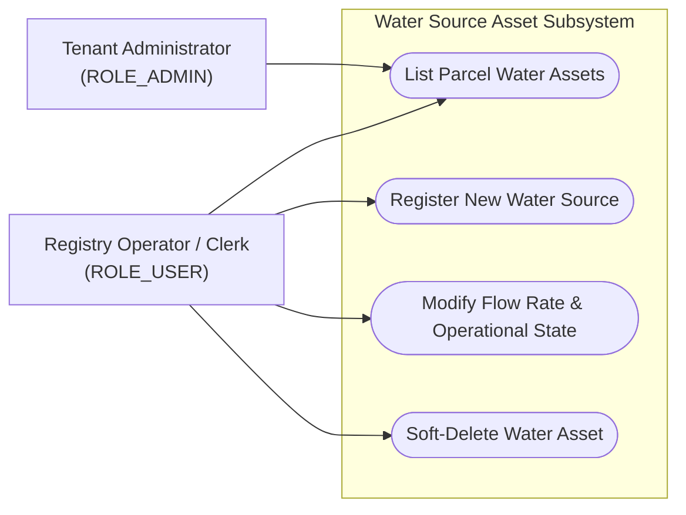
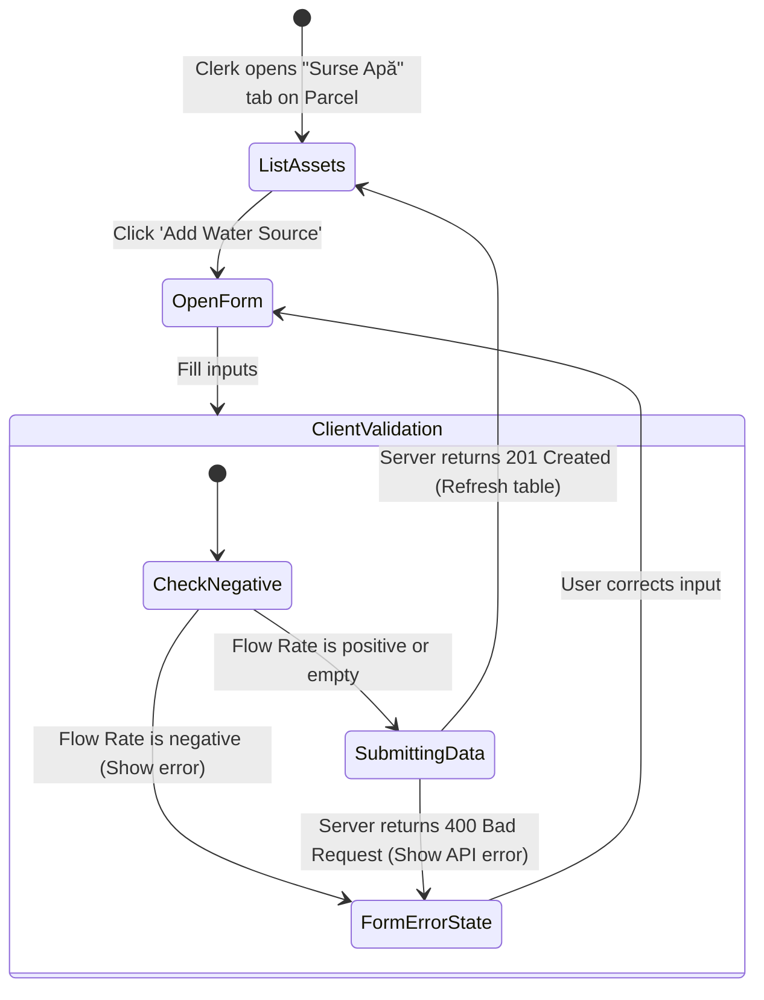
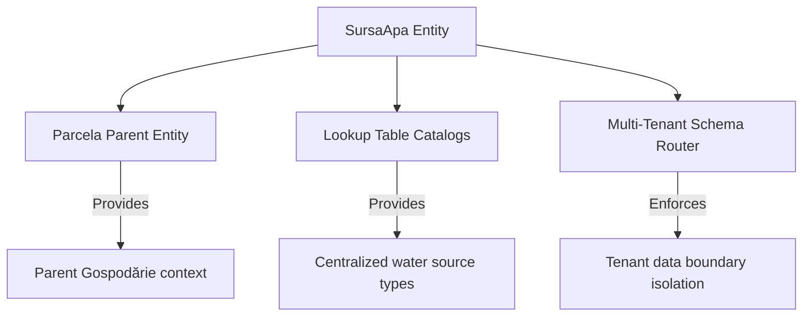

# Feature Specification: Water Source Asset Tracker (Sursă Apă)

## 1. Business Purpose
The primary objective of the Water Source Asset Tracker is to provide a complete, centralized inventory of water access assets linked to agricultural land plots. In agricultural management, water availability is a direct multiplier of land value, crop potential, and overall farm viability. 

This feature serves critical administrative, strategic, and environmental purposes:
* **APIA Subsidy Audit Compliance**: Subsidy applications often require farmers to declare if their plots are irrigated. The municipality must verify and back up these claims with physical water source registries.
* **Irrigation Infrastructure Planning**: Helps local governments assess the municipality's water resources and plan investments in canals, pipe systems, and deep-well grid developments.
* **Environmental & Drought Risk Mitigation**: In times of drought, the city hall can evaluate local water flow capacities (in cubic meters per hour) to manage water use, enforce conservation rules, and draft emergency assistance files.

---

## 2. Actor Goal Alignment Matrix

The Water Source Tracker serves administrative and municipal roles:

| User Role | System Actions | Operational Goals | Trigger Event / Context |
| :--- | :--- | :--- | :--- |
| **ROLE_SUPER_ADMIN**  *(System Administrator)* | • Define global lookup tables for water source categories. • Ensure database schema migrations are executed correctly. | Deliver standard classification catalogs across all tenants, maintaining global system schema integrity. | Triggered during system setup or updates. |
| **ROLE_ADMIN**  *(Tenant Administrator)* | • Review aggregated water capacity statistics across all plots. • Approve water connection permits. • Monitor municipal water assets. | Track local irrigation capacities and coordinate town-hall engineering or agricultural reports. | Triggered during regional resource planning. |
| **ROLE_USER**  *(Operator / Clerk)* | • Log water source characteristics (type, flow, operational status). • Link water assets to specific land parcels. • Soft-delete outdated entries. | Register citizen water source declarations and verify irrigation capabilities on land files. | Triggered during annual census periods or when a citizen registers a new well or connection. |

### Use Case Diagram

---

## 3. Functional Description & Capabilities
The Water Source Asset Tracker is a sub-module of the **Parcelă (Land Plot)** dashboard tab. A single physical land parcel can host zero, one, or multiple active water sources.

Key capabilities include:
1. **Dynamic Asset Inventory**: Clerks can record specific water resource physical assets, such as wells (*Fântână*), natural springs (*Izvor*), public network connections (*Racord Rețea Publică*), or dynamic pumping stations (*Stație de Pompare*).
2. **Volumetric Capacity Logging (Flow Rate)**: The system records the active water capacity flow rate measured in **Cubic Meters per Hour ($m^3/h$)** (`debitMcOra`), establishing a measurable baseline for irrigation potential.
3. **Operational Status Toggling**: Assets can be flagged as operational (`true`) or non-functional (`false`). This allows the municipality to keep historical records of broken, dry, or suspended water assets without deleting them from the system.
4. **Soft Deletion Auditing**: Deleting a water source removes it from the clerk's active list via a soft-delete mechanism, ensuring that historical registry data remains retrievable for deep audit logs.

---

## 4. Use Case Playbook & Scenarios

### Use Case 5.1: Register Water Source on Land Parcel
* **Primary Actor**: Municipal Clerk (`ROLE_USER`)
* **Pre-conditions**: Clerk has navigated to a valid household, opened the "Terenuri Agricole" tab, and selected a parcel.
* **Post-conditions**: The water source is validated, linked to the active parcel, and saved in the database.

#### A. Standard Success Path (Happy Path)
1. The clerk clicks the "Water Sources (Surse Apă)" tab on Parcel #23.
2. The UI renders the active water assets table.
3. The clerk clicks "Adaugă Sursă Apă" (Add Water Source).
4. The system opens a form. The clerk selects **Fântână Forată (Deep Well)** from the source type dropdown.
5. The clerk enters the estimated flow rate of **4.5** $m^3/h$.
6. The clerk toggles the operational status checkbox to **Activ** (Functionare).
7. The clerk clicks "Salvează".
8. The backend validates that the flow rate is positive, links the record to Parcel #23, writes to the tenant database schema, and returns `201 Created`.
9. The UI closes the form, displays a success toast notification, and refreshes the water sources grid.

#### B. Exception Path: Negative Flow Rate Input
* *At step 5*: The clerk enters a negative flow rate of **-1.5** $m^3/h$.
* *System Behavior*:
  1. Upon clicking "Salvează", the backend service intercepts the request and evaluates the input parameter: `dto.getDebitMcOra() < 0`.
  2. The service throws an `IllegalArgumentException` and aborts the database transaction.
  3. The controller returns an HTTP `400 Bad Request` response with the message: `"debitMcOra trebuie sa fie >= 0"`.
  4. The frontend intercepts the error and displays a bold red alert: *“Eroare la salvare: debitMcOra trebuie sa fie >= 0”*, keeping the form open for the clerk to fix the error.

---

## 5. Comprehensive Data Dictionary

This table defines the parameters managed by the Water Source Tracker:

| Field Name (Logical) | Database Column | Data Type | Optionality | Validations & Business Rules |
| :--- | :--- | :--- | :--- | :--- |
| **Water Source ID** | `id` | Long | **Mandatory** *(Auto)* | Primary key, automatically generated. |
| **Source Type** | `tip_sursa` | String (100) | **Mandatory** | Standard type. Pulls from dynamic lookups (e.g., Well, Connection, Spring). |
| **Flow Rate ($m^3/h$)** | `debit_mc_ora` | Double | *Optional* | Flow capacity in Cubic Meters/Hour. Must be positive or zero (`>= 0`). |
| **Operational State** | `stare_functionare` | Boolean | **Mandatory** | Operational status. Defaults to `true` (Functional). |
| **Parcel ID** | `parcela_id` | Long | **Mandatory** | Foreign key linking the asset to the parent land plot (`Parcela`). |

---

## 6. UI-UX Interaction & State Transitions

The state diagram details how the water source form manages validations, server communication, and error feedback:

### UX Design Rules:
* **Simple Operational Indicator**: The active status in the grid must render as a styled badge: a solid green pill with *"Funcțională"* for true, and a soft red pill with *"Inoperabilă"* for false. This provides instant visual status feedback.
* **Quick Form Prefill**: On opening the form, the Flow Rate input field must default to `0,0`, with the cursor focused, helping clerks enter data quickly.

---

## 7. Traceability Matrix & Dependencies

The Water Source Tracker integrates with the core multi-tenant security layers:

* **Parent Plot Relation (`Parcela`)**: Anchors the asset. Any deletion or modification of a parent parcel cascades through Hibernate shadow triggers to manage children water records.
* **Dynamic Lookups (`tipuri_sursa_apa`)**: Restricts the "Source Type" dropdown choices to standardized lookup keys, preventing clerks from typing inconsistent descriptors.
* **Tenant Schema Isolation**: Database queries run inside the active tenant schema, ensuring that water source registries from neighboring cities are completely invisible.

---

## 8. Non-Functional Requirements (NFRs)

* **Performance & Speed Boundaries**:
  - Listing water sources for a selected plot must resolve in **under 100ms**.
  - Toggling an asset's operational status must commit and update the UI in **under 150ms**.
* **Soft Delete Integrity**:
  - To preserve historical data, water source records must never be hard-deleted. The database maintains a `deleted` column, with SQL restriction clauses mapping active queries.
* **Format & Localization Rules**:
  - Flow capacities are measured in **Cubic Meters per Hour ($m^3/h$)**, formatted using Romanian decimal notations (e.g., `4,5 mc/h`).
  - Interface text is localized to **Romanian**.
