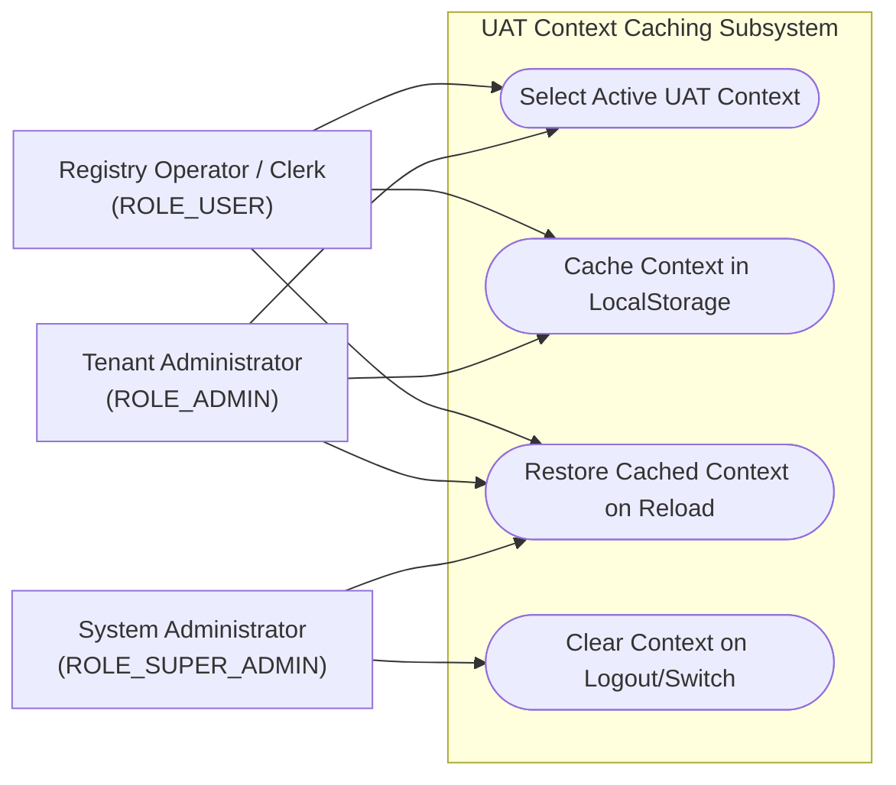
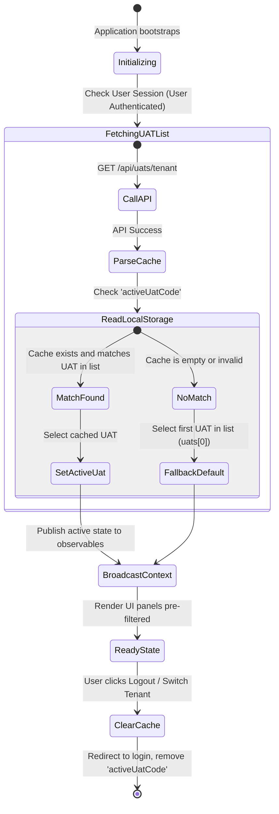
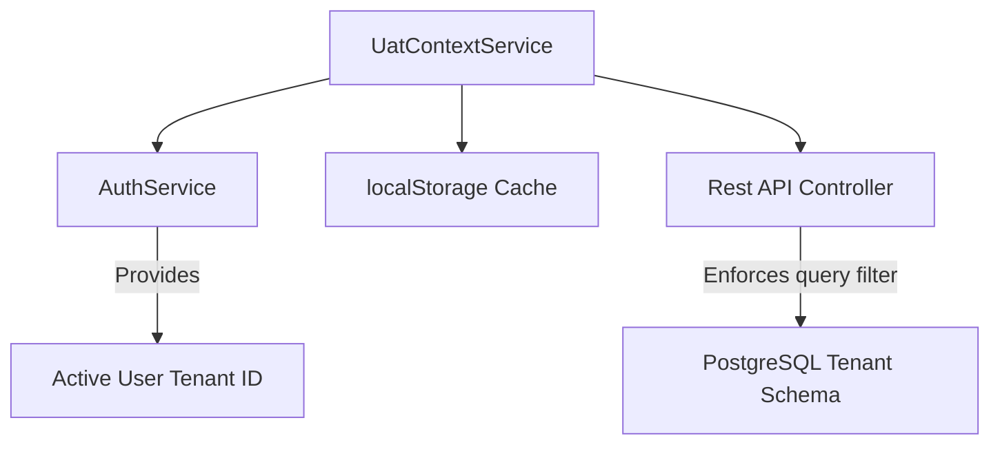

# Feature Specification: UAT Context Caching & Memory

## 1. Business Purpose
The primary objective of the UAT Context Caching & Memory feature is to provide a seamless, non-repetitive, and stable multi-tenant user experience. In the public agricultural registry, a municipality (Tenant) can manage multiple **UATs (Unități Administrativ-Teritoriale)**—which are distinct sub-municipalities, villages, communes, or towns under the city hall's administrative scope.

When municipal clerks operate the platform, they must select which UAT context they are currently writing records for. Without a caching and memory mechanism, the clerk would be forced to re-select the target UAT every time they refreshed their browser, transitioned between dashboard tabs, or logged back into their workspace. This leads to several business issues:
* **Administrative Latency & Friction**: Clerks waste valuable time re-selecting the village or sector context during high-volume data-entry queues.
* **Accidental Data Entry Errors**: If the active context resets to a default value silently, a clerk might accidentally write a household, plot, or livestock record to the wrong village registry, creating administrative confusion.
* **Inconsistent User Interface**: Sudden changes in context between clicks break the user's focus and flow, making the software feel cheap and unpolished.

---

## 2. Actor Goal Alignment Matrix

The context caching service operates at the interface layer, aligning goals across administrative roles:

| User Role | System Actions | Operational Goals | Trigger Event / Context |
| :--- | :--- | :--- | :--- |
| **ROLE_SUPER_ADMIN**  *(System Administrator)* | • Impersonate a local tenant (city hall). • Automatically load the impersonated tenant's sub-UAT list. • Safely clear context upon logging out of impersonation. | Seamlessly audit and configure different municipalities without manually managing local credentials or cookies. | Triggers when the administrator selects "Impersonate" from the county-level tenant portal. |
| **ROLE_ADMIN**  *(Tenant Administrator)* | • Manage local personnel directories. • Filter staff records by UAT context. • Maintain active UAT configurations. | Oversee staff folders and operations with the system remembering which sub-office or village they are viewing. | Triggers when logging into the local municipal portal. |
| **ROLE_USER**  *(Operator / Clerk)* | • Select the active target UAT (village/commune) in the sidebar. • Ensure the interface remembers the active village across page reloads. | Ensure all households, crop cycles, and water sources are registered under the correct village without repetitive clicks. | Triggers during daily citizen declaration sessions. |

### Use Case Diagram

---

## 3. Functional Description & Capabilities
The UAT Context Caching module is a reactive context-state service (`UatContextService`) integrated into the Angular framework. It acts as the "memory core" of the operator's interface:

1. **Reactive State Broker**: Maintains an active `BehaviorSubject` observable (`activeUat$`) that publishes context changes instantly to all listening components (sidebar, lists, maps, forms).
2. **Persistent Local Caching**: Leverages the browser's `localStorage` API to write and read the active `codSiruta` under the key `activeUatCode`. This ensures memory persistence even if the clerk closes the browser tab or restarts their computer.
3. **Impersonation Handlers**: Automatically switches active contexts when a Super Admin activates or deactivates tenant impersonation, clearing the cache when returning to the global dashboard to prevent cross-tenant data leakage.
4. **Clean Fallbacks**: If no cache is found (e.g., first-time load), the system evaluates the available UAT list and automatically falls back to the first available UAT, ensuring the clerk is never left in an unselected, broken state.

---

## 4. Use Case Playbook & Scenarios

### Use Case 2.1: Operator Switches Active Village Context
* **Primary Actor**: Municipal Clerk (`ROLE_USER`)
* **Pre-conditions**: Clerk is authenticated and logged into a tenant that manages multiple sub-UATs (e.g., Cluj-Napoca and Apahida).
* **Post-conditions**: The active context is updated, written to the local cache, and published to all active views.

#### A. Standard Success Path (Happy Path)
1. The clerk opens the sidebar navigation and clicks the active UAT dropdown.
2. The dropdown displays the available sub-UATs: *Cluj-Napoca (SIRUTA: 12345)* and *Apahida (SIRUTA: 56789)*.
3. The clerk selects **Apahida**.
4. The sidebar component intercepts the click and invokes `UatContextService.setActiveUat(apahidaUat)`.
5. The context service publishes the new `activeUat` state to the `BehaviorSubject`.
6. The service writes the code `'56789'` to `localStorage` under `'activeUatCode'`.
7. All active components on the screen (such as the Household directory table) intercept the change, execute a new API fetch with the parameter `uatCode=56789`, and refresh their lists to show Apahida's records.

---

### Use Case 2.2: Clerk Refreshes the Browser
* **Primary Actor**: Municipal Clerk
* **Pre-conditions**: Clerk has previously set the active context to "Apahida" and hits F5 to reload the page.
* **Post-conditions**: The application re-reads the cache on startup and seamlessly restores Apahida as the active context.

#### A. Standard Success Path (Happy Path)
1. The clerk presses F5. The browser clears its memory and reloads the Angular SPA.
2. During bootstrap, `UatContextService` initializes and subscribes to the user context.
3. The service fetches the available UAT list from `/api/uats/tenant`.
4. Upon receiving the list, the service calls `localStorage.getItem('activeUatCode')` and retrieves `'56789'`.
5. The service searches the loaded list and finds the matching UAT profile for **Apahida**.
6. The service sets Apahida as the active context and publishes it to the state.
7. The application renders the interface with the Apahida context pre-selected, skipping any setup screens.

#### B. Alternative Path: Cache Corrupted or Out-of-Sync
* *At step 4*: The value retrieved from `localStorage` is `'99999'` (a cached code that does not exist in the active tenant's UAT list, possibly due to a manual alteration or an obsolete setup).
* *System Behavior*:
  1. The service searches the loaded list and returns `null` (no match found).
  2. The service falls back to setting the first available UAT in the list (`uats[0]`, e.g., Cluj-Napoca) as active.
  3. The service updates `localStorage` with Cluj-Napoca's valid SIRUTA code, resolving the conflict.

---

## 5. Comprehensive Data Dictionary

This data dictionary outlines the caching variables managed at the client interface layer:

| Logical Name | Client Variable Name | Data Type | Storage Medium | Validation & Business Rules |
| :--- | :--- | :--- | :--- | :--- |
| **Active UAT Cache** | `activeUatCode` | String | `localStorage` | Must match the SIRUTA code of a UAT that exists within the active authenticated tenant. |
| **Available UATs** | `availableUats$` | Observable Array | In-Memory (RxJS) | Populated via `/api/uats/tenant` on login. Cleared on logout. |
| **Active UAT State** | `activeUat$` | Observable Object | In-Memory (RxJS) | The currently active UAT model. Broadcasts changes to UI widgets in real-time. |

---

## 6. UI-UX Interaction & State Transitions

The state flow diagram maps how the application manages cache restoration, fallback, and cleanup during session state changes:

### UX Design Rules:
* **Active Selector Visual Glow**: When the active context is loaded from cache, the sidebar selector must display a brief green transition highlight to indicate a saved state was successfully restored.
* **Graceful Null State Handler**: If the tenant contains zero UAT configurations, the application must display a modal dialogue: *“Atenție: Acest cont nu are nicio unitate administrativă asociată. Contactați administratorul.”* and lock all form inputs.

---

## 7. Traceability Matrix & Dependencies

The Context service coordinates data filtering between the user interface and secure database layers:

* **Authentication Sync (`AuthService`)**: If `AuthService` emits a null user (indicating session expiration or logout), `UatContextService` intercepts the state, calls `reset()`, and clears `localStorage` to guarantee no cached values leak to subsequent logins.
* **REST API Filtering**: Every data-entry controller (e.g., `GospodarieController`) requires a UAT identifier parameter on requests. The frontend intercepts the active state from `UatContextService` and appends the active SIRUTA code to all API calls.

---

## 8. Non-Functional Requirements (NFRs)

* **Cache Hydration Speed**: The restoration of the active UAT context from `localStorage` must execute in **under 10ms** after receiving the UAT database catalog.
* **Security & Privacy Isolation**:
  - The cache must only store the non-sensitive public geography code (SIRUTA). No user IDs, tokens, or personal identifiers are permitted inside `localStorage`.
  - Upon logging out, the cache must be cleared explicitly using `localStorage.removeItem('activeUatCode')`, ensuring subsequent users on a shared computer start with a clean session.
* **Browser Compatibility**: Caching mechanisms must run on standard HTML5 Web Storage APIs, compatible with Google Chrome, Mozilla Firefox, Safari, and Microsoft Edge.
