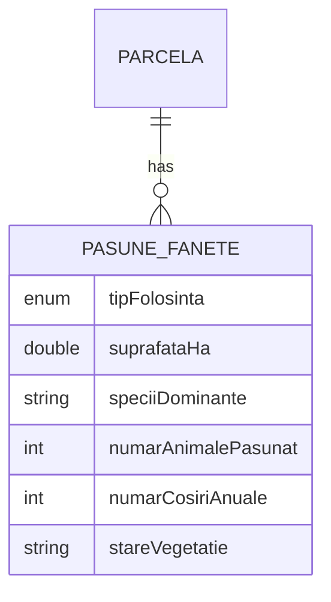
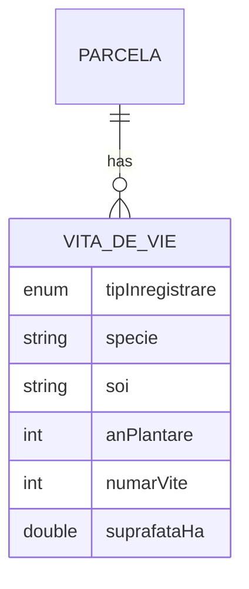
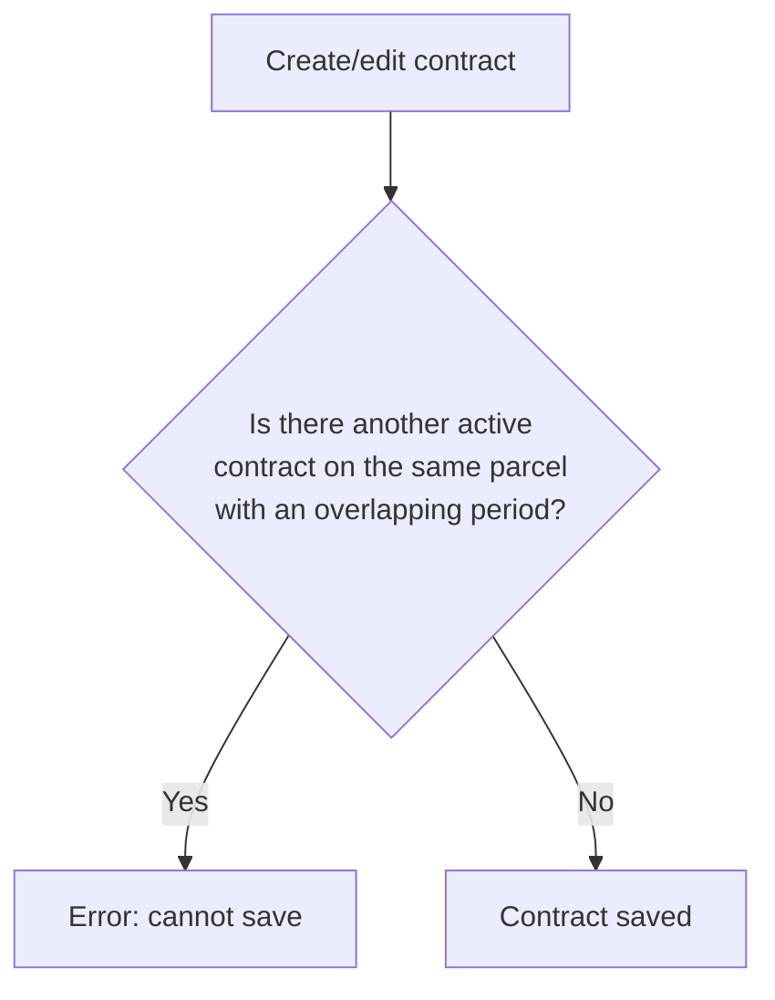
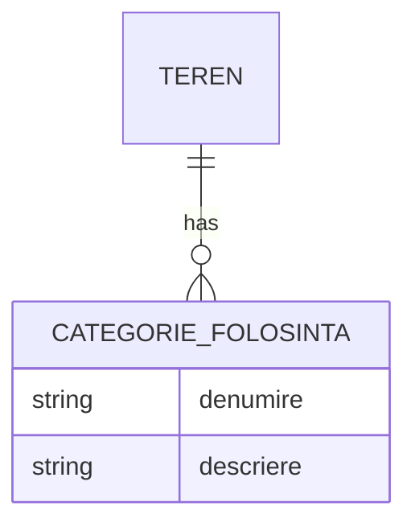
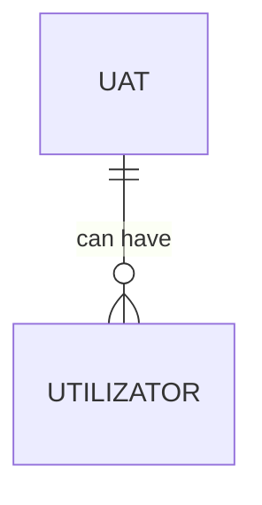

## Table of contents

1. [Electronic contract signature (SignNow)](#1-electronic-contract-signature-signnow)
2. [Pasture/hayfield records](#2-pasturehayfield-records)
3. [Vineyard records](#3-vineyard-records)
4. [Security, performance and UX hardening](#4-security-performance-and-ux-hardening)
5. [Controller authorization + contract integrity](#5-controller-authorization--contract-integrity)
6. [Google Maps integration](#6-google-maps-integration)
7. [Land Use Category CRUD](#7-land-use-category-crud)
8. [Early module refactor](#8-early-module-refactor)
9. [UAT management page](#9-uat-management-page)

---

## 1. Electronic contract signature (SignNow)

### What it does

Allows a land-use contract (lease, loan-for-use, concession, etc.) to be sent for electronic signature to an external signer by email, without needing a physical meeting or printing. The system automatically tracks whether the document has been signed and keeps a copy of the signed document, with proof of integrity (hash).

It doesn't introduce a new entity — it extends the existing **Land Use Contract** entity with everything related to the signature.

### Domain entities

**Land Use Contract** (extended)

| Attribute | Type | Description |
|---|---|---|
| tipContract | enum: ARENDA, COMODAT, CONCESIUNE, INCHIRIERE, ALTELE | type of legal relationship (lease, loan-for-use, concession, rental, other) |
| numarContract | text | contract identifier |
| dataSemnare / dataInceput / dataSfarsit | date | validity period |
| statusContract | enum: ACTIV, EXPIRAT, REZILIAT, SUSPENDAT | current status (active, expired, terminated, suspended) |
| parcela | relation → Parcel | the land parcel it refers to |
| locatorProprietar / locatorUtilizator | relation → Person | the parties to the contract |
| **semnatElectronic** | boolean | whether it has been digitally signed |
| **dataSemnaturiiElectronice** | date/time | when it was signed |
| **caleDocumentSemnat** / **hashDocumentSemnat** | text | where the file is stored + its fingerprint (SHA-256), as proof the file wasn't altered after signing |
| **signNowStatus / signNowDocumentId / signNowEmailSemnatar** | text | status from the external SignNow system |

### Flow diagram

```mermaid
flowchart LR
    A[Existing contract] -->|"Send for signature"| B[Generate contract PDF]
    B --> C[Upload document to SignNow]
    C --> D[Invitation sent to signer's email]
    D --> E{Has the signer signed?}
    E -- "Not yet" --> F["Check status" (manual)]
    F --> E
    E -- Yes --> G[Download signed document + compute hash]
    G --> H[Contract marked: electronically signed]
```

### Use cases

- **As `ROLE_USER`/`ROLE_ADMIN`/`ROLE_SUPER_ADMIN`**, I can send an existing contract for electronic signature by entering the signer's email address.
- **As a user**, I can manually check whether a contract sent for signature has already been signed.
- **As a user**, I can download the signed PDF document once the signature is confirmed.
- **Precondition:** the contract must not already be electronically signed (a signed contract cannot be re-sent).
- **Business rule:** the signature is "free form" (the signer can place the signature anywhere in the document) — a fixed signature position cannot be enforced with the SignNow plan in use.

---

## 2. Pasture/hayfield records

### What it does

Adds the ability to record, for a land parcel, that it's used as pasture or hayfield — with agronomic details (species, yield, condition, maintenance/irrigation system). It's a descriptive record, not tied to any external workflow.

### Domain entities

**Pasture/Hayfield** (new, 1 parcel → N records)

| Attribute | Type | Description |
|---|---|---|
| tipFolosinta | enum: PASUNAT, COSIT, MIXT | usage type (grazing, mowing, mixed) |
| suprafataHa | number | area used |
| speciiDominante | text | e.g. fescue, clover |
| numarAnimalePasunat | number | relevant only if type is PASUNAT (grazing) |
| numarCosiriAnuale | number | relevant only if type is COSIT (mowing) |
| productieEstimataKgHa | number | estimated yield (green mass/hay) |
| stareVegetatie | text | good / degraded / regenerating |
| sistemIntretinere / sistemIrigare | text | organic / conventional, etc. |
| parcela | relation → Parcel | the parcel it belongs to |



### Use cases

- **As `ROLE_USER`**, I can add/edit/delete a pasture/hayfield record for a parcel in my tenant.
- **As `ROLE_USER`**, I can filter a parcel's records by type (grazing/mowing/mixed).
- **Precondition:** the parcel must exist and belong to the current tenant.

---

## 3. Vineyard records

### What it does

Similar to pasture/hayfield records (section 2), but for vineyard plantations or isolated vine stocks on a parcel — variety, planting year, density, condition, estimated yield.

### Domain entities

**Vineyard record** (new, 1 parcel → N records)

| Attribute | Type | Description |
|---|---|---|
| tipInregistrare | enum: IZOLAT, PLANTATIE | isolated vines vs. organized plantation |
| specie / soi | text | e.g. Fetească Regală, Cabernet Sauvignon (free text, no fixed list) |
| anPlantare | number | planting year |
| numarVite | number | relevant only for IZOLAT (isolated) |
| suprafataHa / densitateViteHa | number | relevant only for PLANTATIE (plantation) |
| stareVita | text | young / bearing / aging |
| productieEstimataKg | number | estimated yield |
| parcela | relation → Parcel | the parcel it belongs to |



### Use cases

- **As `ROLE_USER`**, I can add/edit/delete a vineyard record for a parcel in my tenant.
- **As `ROLE_USER`**, if I try to modify a record using an ID that doesn't belong to the parcel indicated in the URL, the system rejects the operation (protection against ID tampering).

---

## 4. Security, performance and UX hardening

### What it does

Doesn't add a new domain entity — it's a set of "infrastructure" improvements: removes hardcoded passwords/secrets from configuration, adds database indexes for faster queries (large lists of households/land/parcels/contracts), and replaces browser `alert()` popups with in-app visual (toast) notifications.

### Affected entities

No new entities. Adds indexes (not new columns) on already-existing entities: Household, Land, Parcel, Land Use Contract, Animal, Person, Document, UAT.

### Use cases

- **As the application operator**, I configure `JWT_SECRET`/database passwords from environment variables in production, not from files committed to code.
- **As an application user**, I get a discreet visual (toast) notification when an action succeeds or fails, instead of a blocking browser popup.
- **As a user working with large lists** (thousands of parcels/contracts), filter/list queries respond faster thanks to the new indexes.

---

## 5. Controller authorization + contract integrity

### What it does

Two distinct things, grouped on the same branch:

1. **Restricts by role** who can create/modify/delete data across ~13 modules (previously, any authenticated user could do anything regardless of role — including a regular `ROLE_USER` being able to delete UATs, a global reference table).
2. **Prevents overlapping contracts** — a second active contract can no longer be created on the same parcel/land for a date range that overlaps with an already-active contract.

### Domain entities

No new entities. Introduces a **business rule** on the **Land Use Contract** entity: two active contracts cannot coexist on the same parcel/land with overlapping periods.



### Use cases

- **As `ROLE_ADMIN`/`ROLE_SUPER_ADMIN`**, I can create/edit/delete UATs; a regular `ROLE_USER` can no longer do this (not even via a direct API call).
- **As any user creating a contract**, if the parcel/land already has an active contract in the same period, I get an explicit error and the contract is not saved.
- **As an unauthenticated user or one with insufficient role**, I'm automatically redirected to login or to my role's home page if I try to navigate to a protected page.

---

## 6. Google Maps integration

### What it does

Replaces the previous map (Leaflet) with Google Maps for drawing/editing a parcel's polygon on the map, and adds address autocomplete when entering a piece of land (street suggestions as the user types).

### Affected entities

Doesn't introduce new domain entities — it affects the visual representation (polygon geometry) of the already-existing **Parcel** entity and the "address" field of the **Land** entity.

### Use cases

- **As a user adding a piece of land**, I get street suggestions as I type the address (autocomplete, via OpenStreetMap/Nominatim — not Google Places).
- **As a user adding/editing a parcel**, I draw the parcel outline directly on the Google map, with polygon drawing tools.

---

## 7. Land Use Category CRUD

### What it does

Allows classifying a piece of land by usage categories (e.g. Arable, Pasture, Orchard, Vineyard) — a piece of land can have multiple use categories at once (e.g. part arable, part pasture).

### Domain entities

**Land Use Category** (new, 1 land → N categories)

| Attribute | Type | Description |
|---|---|---|
| denumire | text | e.g. Arable, Pasture, Orchard |
| descriere | long text | optional details |
| teren | relation → Land | the piece of land it belongs to (deleting the land automatically deletes its categories) |



### Use cases

- **As `ROLE_USER`/`ROLE_ADMIN`/`ROLE_SUPER_ADMIN`**, I can add/edit/delete land use categories for a piece of land in my tenant.
- **As a user**, if I delete a piece of land, all its use categories disappear automatically (no orphaned records).

Documented in further detail, from a user perspective, in [`CategorieFolosinta.md`](./CategorieFolosinta.md).

---

## 8. Early module refactor

### What it does

A historical branch, predating the current multi-tenant architecture — cleans up old code from the period when the application had a single flat database schema (not one per tenant/UAT). Contains no functionality relevant to the current architecture.

### Domain entities

The entities from that era (**UAT**, **User**) were later replaced by the current multi-tenant architecture. Doesn't apply to today's model.

### Use cases

Not applicable — branch kept only as history.

---

## 9. UAT management page

### What it does

Adds an administration page for UATs (administrative-territorial units — communes, towns, municipalities), accessible from the super-admin panel: list, add, edit, deactivate.

### Domain entities

**UAT** (new, global reference table — not tied to a single tenant)

| Attribute | Type | Description |
|---|---|---|
| codSiruta | text, unique | official SIRUTA code |
| denumire | text | e.g. Cluj-Napoca |
| judet | text | e.g. Cluj (county) |
| tipUat | text | Municipality / Town / Commune |
| isActive | boolean | whether the UAT is active in the system |



### Use cases

- **As `ROLE_SUPER_ADMIN`**, I can add/edit/deactivate UATs from the administration panel.
- **Note:** at the time this feature was introduced, the role restriction only existed on the frontend page, not on the API — a user with any authenticated role could call the API directly and modify UATs. This gap was later fixed in the branch from section 5.

---

## General notes

- **Multi-tenant:** most entities (Contract, Pasture/Hayfield, Vineyard, Land Use Category) live in a database schema separate per tenant (household/UAT) — isolation between tenants is done at the schema level, not through explicit filtering in every query.
- **UAT is an exception** — it's a global reference table (`public` schema), shared by all tenants, which is why it requires stricter access control (any change affects every user in the system, not just one tenant).
- For step-by-step technical flows, the full SQL schema and code snippets, see [`BranchesDocumentation.md`](./BranchesDocumentation.md).
