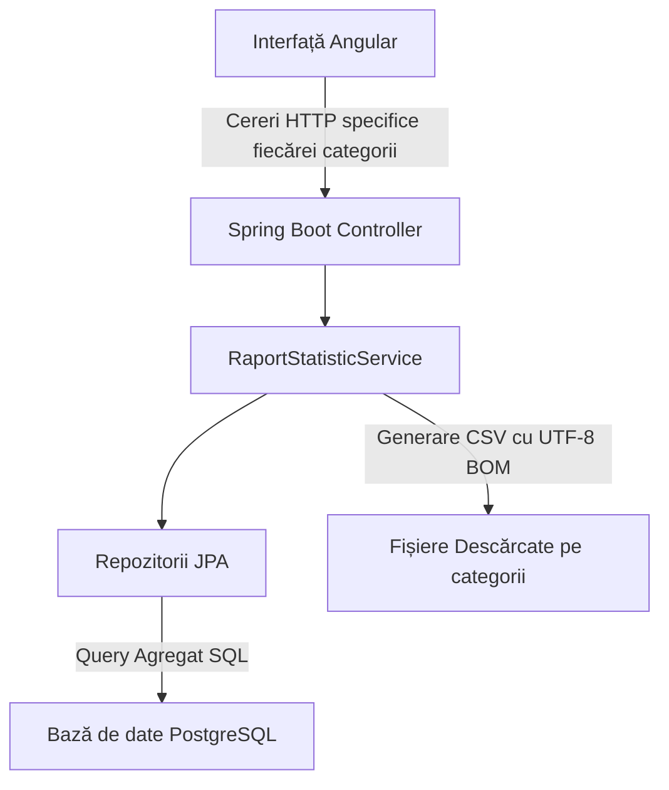

# Documentație: Modulul Centralizatoare Statistice și Export Excel (CSV)

Acest document descrie arhitectura, funcționalitățile și modul de utilizare al noului modul **Centralizatoare Statistice**, conceput pentru a oferi primăriilor și instituțiilor județene (Direcția Agricolă Județeană - DAJ, Institutul Național de Statistică - INS) rapoarte agregate și posibilitatea de a le exporta direct în format Excel (compatibil .csv formatat profesional).

---

## 1. Prezentare Generală (Overview)

Modulul centralizează automat toate datele înregistrate la nivelul unui UAT (Unitate Administrativ-Teritorială) pentru un anumit an de raportare. Pentru o mai bună organizare și modularitate, datele sunt împărțite pe **3 mari categorii (taburi separate în interfață)**, iar utilizatorul poate descărca rapoarte Excel dedicate pentru fiecare categorie în parte:

1. **Sectorul Vegetal (Centralizator Vegetal):**
   * Centralizarea suprafețelor cultivate pe tipuri de culturi agricole și producțiile estimate pentru anul selectat.
   * Centralizarea repartizării terenurilor pe Categorii de Folosință (arabil, pășuni, fânețe, livezi etc.).
   * **Buton de Export:** Generează un fișier Excel/CSV cu toate datele vegetale pe anul respectiv.

2. **Sectorul Zootehnic (Centralizator Zootehnic):**
   * Centralizarea efectivelor de animale identificate individual (crotalate: bovine, ovine, caprine, porcine etc., defalcate pe total, masculi și femele).
   * Centralizarea efectivelor declarate în grup (familii de albine, păsări etc.).
   * **Buton de Export:** Generează un fișier Excel/CSV complet cu situația zootehnică consolidată.

3. **Mijloace de Transport și Utilaje (Centralizator Utilaje):**
   * Inventarul centralizat al numărului total de mașini și utilaje agricole înregistrate în UAT (tractoare, combine, semănători etc.).
   * **Buton de Export:** Generează un fișier Excel/CSV cu parcul de mașini și utilaje.

---

## 2. Arhitectura Tehnică a Implementării

Implementarea este realizată pe o arhitectură **Full-Stack** (Spring Boot + Angular), respectând principiul de multi-tenancy al aplicației.

### A. Backend (Spring Boot)
Datele statistice și rapoartele sunt gestionate separat pentru fiecare categorie de export prin endpoint-uri REST dedicate:

* **Controller ([RaportStatisticController.java](file:///c:/Users/carin/OneDrive/Desktop/RegistrulAgricol/src/backend/src/main/java/com/multitenant/controller/RaportStatisticController.java)):**
  Expune endpoint-uri dedicate pentru exportul fiecărei categorii de date în format Excel (CSV):
  * `GET /api/v1/statistici/complet?an=YYYY` - returnează raportul general JSON pentru popularea graficelor/interfeței.
  * `GET /api/v1/statistici/export/vegetal?an=YYYY` - generează fișierul Excel/CSV pentru sectorul vegetal (suprafețe și culturi).
  * `GET /api/v1/statistici/export/zootehnic` - generează fișierul Excel/CSV pentru efectivele de animale.
  * `GET /api/v1/statistici/export/utilaje` - generează fișierul Excel/CSV pentru parcul de utilaje.

* **Service ([RaportStatisticService.java](file:///c:/Users/carin/OneDrive/Desktop/RegistrulAgricol/src/backend/src/main/java/com/multitenant/service/RaportStatisticService.java)):**
  Conține logica de generare a rapoartelor pentru fiecare categorie în parte. Pentru a asigura deschiderea corectă în Excel pe sistemele în limba română:
  * Fișierele sunt generate cu codificarea **UTF-8 BOM (Byte Order Mark)** (`\uFEFF`) pentru redarea corectă a diacriticelor românești (`ș`, `ț`, `ă`, `â`, `î`).
  * Elementele sunt separate prin `;` (separatorul recunoscut automat de Microsoft Excel).

### B. Frontend (Angular)
Interfața este complet dinamică și organizată pe taburi pentru a oferi acces separat la fiecare categorie:

* **Service ([raport-statistic.service.ts](file:///c:/Users/carin/OneDrive/Desktop/RegistrulAgricol/src/frontend/src/app/services/raport-statistic.service.ts)):**
  Facilitează descărcarea asincronă a fiecărui raport prin apeluri HTTP specifice:
  * `exportVegetal(an)`
  * `exportZootehnic()`
  * `exportUtilaje()`

* **Pagina de Statistici ([statistici.component.ts](file:///c:/Users/carin/OneDrive/Desktop/RegistrulAgricol/src/frontend/src/app/pages/statistici/statistici.component.ts) și [.html](file:///c:/Users/carin/OneDrive/Desktop/RegistrulAgricol/src/frontend/src/app/pages/statistici/statistici.component.html)):**
  * Include un **selector de an** dinamic pentru sectorul vegetal.
  * Folosește **taburi interactive** pentru vizualizare separată.
  * Fiecare tab conține propriul său buton **Exportă Raport Excel (CSV)**. Când ești pe tabul "Sector Vegetal", apeși export și descarci raportul de vegetale. La fel și pentru Zootehnic sau Utilaje!

---

## 3. Detaliile fișierelor exportate

Fiecare dintre cele **3 fișiere Excel (CSV)** exportate este formatat specific pentru categoria sa:

1. **Centralizator Vegetal (`centralizator_vegetal_[an].csv`):**
   * Antet administrativ cu numele UAT-ului și anul raportat.
   * Tabel culturi agricole: Specie, Suprafață totală (ha), Producție totală estimată (t).
   * Tabel categorii folosință: Categorie de folosință, Suprafață (ha).

2. **Centralizator Zootehnic (`centralizator_zootehnic.csv`):**
   * Antet administrativ și lista consolidată a animalelor.
   * Animale identificate individual (Crotalate): Specie, Total Capete, Masculi, Femele.
   * Efective de grup (Păsări, Albine): Specie/Categorie grup, Total Capete/Familii.

3. **Centralizator Utilaje (`centralizator_utilaje.csv`):**
   * Antet administrativ și situația utilajelor active.
   * Tabel utilaje: Denumire / Tip utilaj sau mașină agricolă, Total unități înregistrate.

---

